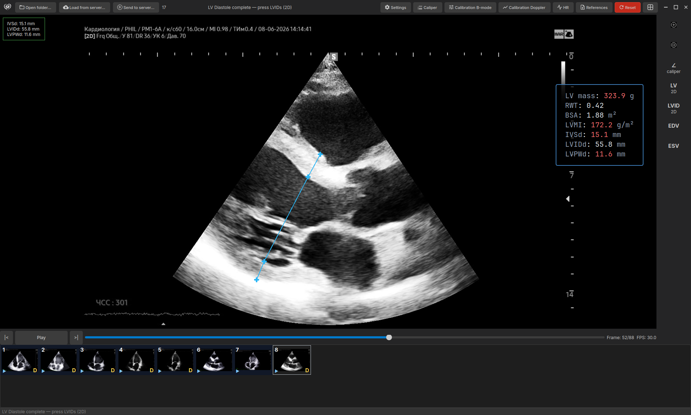
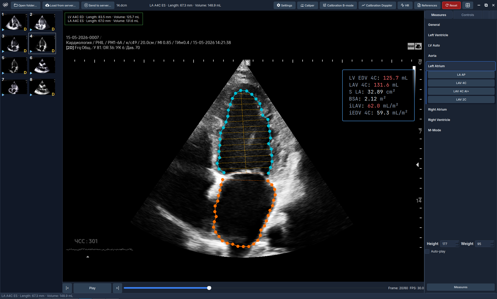
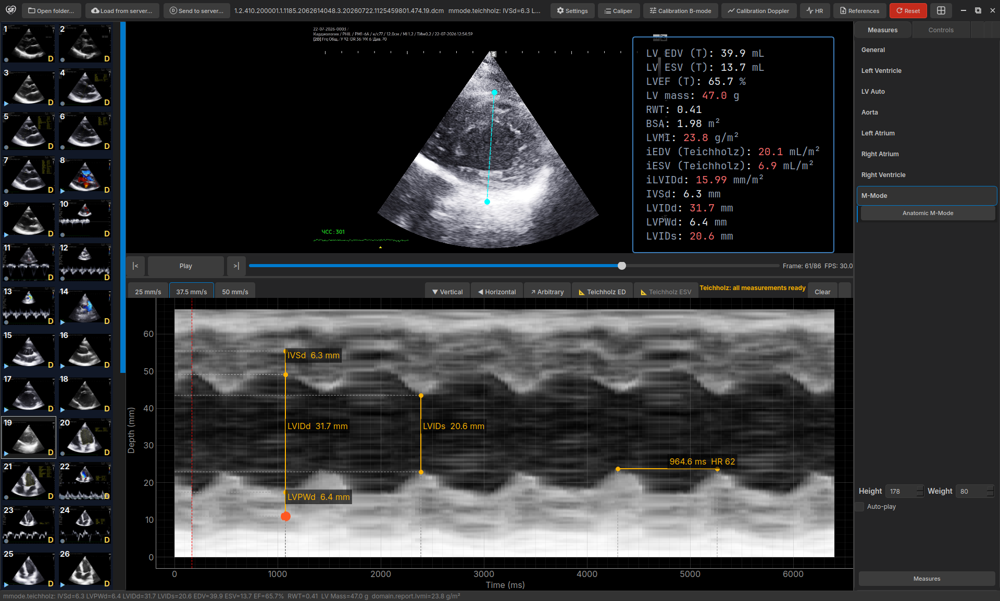

<div align="center">

# SonoForge

### Open-Source Desktop Echocardiography Analysis Platform

[](https://www.python.org/downloads/)
[](LICENSE)
[](https://github.com/areatu/SonoForge/actions)
[](https://github.com/areatu/SonoForge/releases)
[](https://coveralls.io/github/areatu/SonoForge?branch=main)
[](https://doi.org/10.5281/zenodo.21463212)

---

**SonoForge** is a free, open-source desktop application for **echocardiography analysis**, **DICOM viewing**, **cardiac measurements**, and **clinical reporting**. Built for cardiologists, sonographers, and researchers who need a powerful, offline-capable tool that complies with **ASE (American Society of Echocardiography) guidelines**.

[🇷🇺 Русская версия](README_RU.md)

[Installation](#installation) · [Features](#features) · [Quick Start](#quick-start) · [Documentation](#documentation) · [Contributing](#contributing)

</div>

---

## 📦 Installation

<details open>
<summary><strong>Linux (.deb) — Recommended</strong></summary>

```bash
# Download latest release
wget https://github.com/areatu/SonoForge/releases/latest/download/sonoforge_*.deb

# Install
sudo dpkg -i sonoforge_*.deb

# Run
sonoforge
```

First run will automatically create a virtual environment, install Python dependencies, and optionally download AI segmentation models.

</details>

<details>
<summary><strong>Windows (.exe)</strong></summary>

1. Download `SonoForge-Setup-*.exe` from [Releases](https://github.com/areatu/SonoForge/releases)
2. Run the installer and follow the setup wizard
3. Launch SonoForge from the Start Menu or desktop shortcut

> **Requires:** Windows 10/11 (64-bit)

First run will automatically set up the environment and install all dependencies.

</details>

<details>
<summary><strong>macOS (.zip)</strong></summary>

1. Download `SonoForge-macOS-*.zip` from [Releases](https://github.com/areatu/SonoForge/releases)
2. Extract to Applications folder
3. Run `SonoForge.app`

> **Requires:** macOS 12.0+ (Intel or Apple Silicon)

First run will automatically create a virtual environment, install Python dependencies, and optionally download AI segmentation models.

</details>

<details>
<summary><strong>From Source (Development)</strong></summary>

```bash
git clone https://github.com/areatu/SonoForge.git
cd SonoForge

# With uv (recommended)
uv sync --extra dev
uv run sonoforge

# Or pip
pip install -e ".[dev]"
python -m echo_personal_tool
```

</details>

---

## 🚀 Features

SonoForge provides a comprehensive set of tools for **echocardiographic assessment**, from basic measurements to advanced AI-powered analysis.

### 📊 Cardiac Measurements

| Category | Measurements | Description |
|----------|--------------|-------------|
| **Linear (M-Mode/B-Mode)** | LVEDD, LVESD, IVSd, IVSs, LVPWd, LVPWs, TAPSE, RVOT, LA diameter | Standard ASE linear measurements with real-time caliper labels |
| **Volumetric (Simpson Biplane)** | EDV, ESV, LVEF, LAVi, RAVi | Biplane Simpson's method with open-arc mitral annulus tracking |
| **M-Mode** | Posterior wall thickness, LV dimensions, fractional shortening | Time-depth measurements with scan line overlay |
| **RV Function** | FAC (Fractional Area Change), TAPSE, RV S' | Right ventricular assessment |
| **LV Mass** | LVM, LVMI (indexed to BSA), RWT (Relative Wall Thickness) | Geometric and anatomical LV mass calculations |
| **Body Surface Area** | DuBois formula, indexed measurements | Automatic BSA indexing for all volume measurements |
| **ECG-Based HR** | Heart rate from ECG waveform | Automatic ED/ES detection from ECG R-peaks |

<div align="center">



*B-Mode linear measurements with automatic LV mass and LVMI calculation*

</div>

### 🩸 Doppler & Vascular Measurements

- **PSV/EDV Peak Measurement** — Manual peaks on spectral Doppler with automatic RI and S/D indices
- **Vessel Stenosis** — By diameter (%D) and by area (%S) with guided multi-step workflows
- **Cycle Averaging Without ECG** — PSV/EDV averaged over automatically detected cardiac cycles, with manual cycle selection (`←`/`→`, `Enter`)
- **Auto VTI** — Two-click region selection with direction detection, velocity spike filtering, and VTI trace extraction
- **Study-Wide Measurements** — Cross-file persistence within a study (E peak on one file + e′ peaks on TDI file → mean E/e′ in the overlay)

### 🎚️ Doppler Auto-Calibration

- **Velocity Scale Detection** — Automatic calibration from ruler ticks with grid-line fallback
- **Sweep Speed Calibration** — Samsung RS85 tick detector for time-axis calibration (linear tick-spacing model)
- **Baseline Line Detection** — Visual baseline detector with line → DICOM tag → intensity priority chain
- **Manual 2-Click Wizard** — Calibration wizard with snapping to detected ticks; auto-detection never overrides manual calibration

### 🤖 AI-Powered Segmentation

SonoForge integrates **ONNX Runtime** for real-time cardiac structure segmentation:

- **LV Auto Segmentation** — Automatic left ventricle contouring in A4C view using EchoNet-Dynamic deep learning model (press `I`)
- **LA Segmentation** — Left atrium cavity segmentation in end-systolic frames
- **LA AI Assist** — AI-assisted LA contour refinement with optical flow boundary detection
- **Mitral Annulus Detection** — AI-assisted landmark detection for mitral valve annulus
- **Temporal Fusion** — Multi-frame temporal consistency using N±2 neighbor voting for stable contour propagation
- **Active Contour Refinement** — Edge-snapping and gradient-based contour refinement (press `R`)
- **Open-Arc Simpson** — Manual contour initialization with mitral annulus points and apex

<div align="center">



*Left atrium segmentation with automatic volume calculation and BSA indexing*

</div>

### 🏥 DICOM Integration & PACS Connectivity

Full DICOM connectivity for seamless integration with hospital information systems:

| Protocol | Operations | Description |
|----------|------------|-------------|
| **DICOMweb (WADO-RS)** | QIDO-RS, WADO-RS, STOW-RS | HTTP-based DICOM access (default) |
| **DIMSE (C-FIND)** | Study/Series/Instance search | Query PACS for patient studies |
| **DIMSE (C-GET)** | Single instance retrieval | Download DICOM objects via DIMSE |
| **DIMSE (C-MOVE)** | Bulk series retrieval | Move DICOM objects to embedded Storage SCP |
| **DIMSE (C-STORE)** | DICOM upload | Send local DICOM files to PACS |
| **TLS** | Encrypted associations | Secure DIMSE communication with certificate validation |

**Supported PACS:** Orthanc, DCM4CHEE, Conquest, and any DICOMweb/DIMSE compliant server.

### 📈 Clinical Reporting & Export

- **Study Summary** — Comprehensive report with all measurements, calculations, and indexed values
- **PDF Export** — Clinical-grade PDF reports with patient information, measurements, and reference ranges
- **ASE Reference Norms** — Built-in reference tables for adult echocardiography (age/sex-specific)
- **Structured Reports** — DICOM SR-compatible output
- **Constructor** — Custom reference browser editor with Excel import, PDF/HTML export

### 📖 Reference Constructor — Personalized Clinical References

SonoForge includes a **built-in Reference Constructor** that lets you build and maintain your own library of clinical reference materials directly within the application — no coding required.

**What you can add:**
- ASE guideline tables (normal values by age, sex, BSA)
- Your own measurement nomograms and scoring systems
- Protocol checklists and reporting templates
- PDF documents, images, and structured data
- Any structured reference material used in daily echocardiography practice

**How it works:**
- **Import** — Add references from Excel (.xlsx), YAML, or built-in ASE tables
- **Edit** — Modify values, add new parameters, customize ranges inline
- **Organize** — Group references by category (LV, RV, Valves, Pediatrics, etc.)
- **Export** — Share your reference library as PDF or HTML for colleagues
- **Sync** — Reference data is saved locally and persists across sessions

The Constructor is designed for **clinicians, not developers** — a simple point-and-click interface for managing the reference data you rely on every day.

**Web-Based Reference Viewer:**
The structured reference browser opens as a fast web view (QWebEngine) with automatic fallback to a native Qt widget:
- **Instant Search** — Search across all topics, pathologies, and parameters, plus age-based filtering
- **Inline Editing** — Edit values directly in tables; changes are saved back to YAML
- **Image Lightbox** — Full-size image viewing with keyboard navigation
- **Full-Name Tooltips** — Hover any parameter to see its complete descriptive name
- **Theme Sync** — Four CSS themes synchronized with the application dark/light theme

**Expanded Reference Library:**
Beyond adult echocardiography, the built-in handbook now covers vascular ultrasound, thyroid, kidney, abdominal aorta, and lymph node parameters — including regurgitant fraction for MR/AR, pulmonary hypertension echo signs, 3D LVEF/SVi norms, and severity gradations (AS/AR/TR/PR).

### 🎨 User Interface & Experience

- **Dark/Light Theme** — Clinical-friendly color schemes optimized for long reading sessions
- **Dual Viewer** — Side-by-side comparison of different phases or modalities
- **Gallery** — Thumbnail-based study/series navigation
- **Cine Playback** — Smooth DICOM cine loop with variable speed control
- **Window/Level** — Interactive image contrast/brightness adjustment
- **Crosshair** — Spatial reference across synchronized views
- **Keyboard Shortcuts** — Full keyboard navigation for efficient workflow
- **Internationalization (i18n)** — English and Russian language support with live switching
- **Micro-Animations** — Accordion chevrons, panel slides, tab crossfades, button feedback, and skeleton placeholders
- **Polished Dialogs** — ✓/✗ icons on OK/Cancel buttons with tinted shortcut labels across all dialogs
- **Smart Result Overlays** — Re-measuring the same parameter updates the existing value instead of duplicating it

<div align="center">



*M-Mode with Teichholz calculations: IVSd, LVIDd, LVPWd, LVEF*

</div>

### ⚡ Performance & Reliability

- **Smooth Playback** — Forward-arc frame cache eviction eliminates frame skips on large RGB cines; short cines are fully preloaded for seamless looping
- **Non-Blocking PACS** — Asynchronous study/series queries with retries and exponential backoff; cancellable download timeouts (60 s)
- **Server Browser Filters** — Filter studies by date (1/3/30 days) with correct chronological sorting

---

## 🎥 Demo

[](https://youtu.be/vbcIFMZP-3o)

---

## 🏃 Quick Start

> Check the installed version anytime: `sonoforge --version` (current release: **v0.2.4**).

### 1. Open DICOM Data

- **Local Folder:** File → Open Folder → Select directory with DICOM/MP4/JPEG files
- **PACS Server:** File → Load from Server → Select Orthanc/DICOMweb server

### 2. Navigate Studies

- **Gallery** → Select series → Frame opens in main viewer
- **Scroll** through cine frames using mouse wheel or keyboard arrows
- **Play/Pause** with `Space` for automated cine loop

### 3. Perform Measurements

| Tool | Key | Description |
|------|-----|-------------|
| Linear Caliper | `L` | Distance measurement (LVEDD, IVSd, TAPSE, etc.) |
| Simpson Biplane | `C` | LV volume measurement (open-arc contour) |
| M-Mode | `M` | M-Mode trace and measurements |

### 4. View Results

- **Results Panel** — All measurements with indexed values (BSA, age/sex-corrected)
- **PDF Export** — Generate clinical report
- **DICOM SR** — Save structured report to PACS

---

## 📚 Documentation

| Document | Description |
|----------|-------------|
| [SECURITY.md](SECURITY.md) | PHI handling, data security, model integrity, HIPAA considerations |
| [CONTRIBUTING.md](CONTRIBUTING.md) | Contribution guidelines, code style, testing |
| [ROADMAP.md](ROADMAP.md) | Feature status and development roadmap |
| [docs/superpowers/specs/](docs/superpowers/specs/) | Technical specifications (DICOMweb, M-Mode, etc.) |
| [docs/superpowers/plans/](docs/superpowers/plans/) | Implementation plans and sprint backlogs |
| [docs/bench/](docs/bench/) | Performance benchmarks |

---

## 🏗️ Architecture

SonoForge follows **Clean Architecture** principles with clear separation of concerns:

```
src/echo_personal_tool/
├── domain/              # Business logic (no Qt dependency)
│   ├── models/          # Data models: Contour, Doppler, MMode
│   ├── calculations/    # Cardiac calculations: Simpson, Bernoulli, Teichholz
│   └── services/        # Segmentation, tracking, reference data
├── infrastructure/      # External integrations
│   ├── dicom_*.py       # DICOM reading/writing (pydicom)
│   ├── orthanc_*.py     # DICOMweb client (httpx)
│   ├── dimse_*.py       # DIMSE client (pynetdicom)
│   ├── onnx_engine.py   # ONNX inference engine
│   └── server_settings.py # Server connection management
├── application/         # Orchestration layer
│   ├── app_controller.py # Main application controller
│   ├── workers/         # Background workers (11 parallel tasks)
│   └── services/        # Application services
├── presentation/        # GUI layer (PySide6/Qt)
│   ├── main_window.py   # Main application window
│   ├── viewer_widget.py # DICOM image viewer
│   ├── doppler_widget.py # Spectral Doppler display
│   ├── web_reference/   # Web-based reference viewer (QWebEngineView)
│   └── ...              # 30+ UI components
├── constructor/         # Reference browser editor
└── resources/           # Fonts, icons, ASE reference data
```

---

## 🛡️ Security & Privacy

> **Your data stays local.** SonoForge processes all DICOM data in memory — no PHI (Protected Health Information) is written to disk, no cloud uploads, no telemetry, no analytics.

### Security Features

- ✅ **DICOM File Validation** — Validates file integrity before parsing (magic bytes, size limits)
- ✅ **DICOM UID Validation** — Rejects pure-dot UIDs, strings >64 chars, and dot-prefixed/suffixed UIDs per PS3.5 §6.1
- ✅ **Model Integrity** — SHA256 verification for ONNX AI models at load time; corrupted models raise `ModelIntegrityError`
- ✅ **Network Timeouts** — Configurable timeouts for DICOMweb/DIMSE connections
- ✅ **PHI Sanitization** — Patient identifiers truncated in log files
- ✅ **In-Memory Processing** — All DICOM data processed in RAM, no temp files
- ✅ **No Cloud Dependencies** — Works fully offline after installation

See [SECURITY.md](SECURITY.md) for detailed security documentation.

---

## 🤝 Contributing

We welcome contributions from the medical imaging and cardiology community! See [CONTRIBUTING.md](CONTRIBUTING.md) for guidelines.

### Development Setup

```bash
# Install development dependencies
pip install -e ".[dev]"

# Run tests
python -m pytest tests/

# Lint
ruff check src tests

# Format
ruff format src tests
```

**Test Coverage:** ~77% with 4400+ unit tests across all layers (domain, application, presentation, infrastructure).

### Areas for Contribution

- 🩺 New measurement tools (3D echo, valve quantification, etc.)
- 🤖 Additional AI models (RV segmentation, valve detection)
- 🌐 Localization (i18n) for different languages
- 📊 Additional reference databases
- 🐛 Bug fixes and performance improvements

---

## 📜 Citation

If you use SonoForge in your research or clinical practice, please cite:

```bibtex
@software{kuvilkin2026sonoforge,
  author       = {Kuvilkin, Vitaliy},
  title        = {SonoForge: Open-Source Desktop Echocardiography Analysis Platform},
  year         = {2026},
  publisher    = {GitHub},
  url          = {https://github.com/areatu/SonoForge},
  license      = {GPL-3.0}
}
```

---

## 📄 License

[GPL-3.0](LICENSE) — Free software, open source. You are free to use, modify, and distribute this software.

---

## ⚠️ Disclaimer

This software is intended for research, education, and informational purposes only.
It is NOT intended for clinical diagnosis, treatment decisions, or patient care.
Always consult a qualified healthcare professional for medical decisions.
This software has not been reviewed or approved by the FDA, CE, or any regulatory body.

---

<div align="center">

**Built with ❤️ for cardiologists, sonographers, and researchers**

[Report Bug](https://github.com/areatu/SonoForge/issues) · [Request Feature](https://github.com/areatu/SonoForge/issues) · [Discussions](https://github.com/areatu/SonoForge/discussions)

</div>
