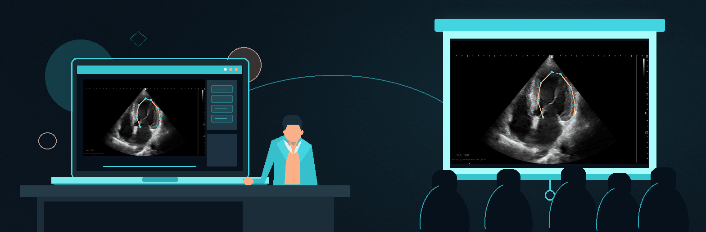

<div align="center">

# SonoForge

### Open-Source Desktop Echocardiography Analysis Platform

[](https://www.python.org/downloads/)
[](LICENSE)
[](https://github.com/areatu/SonoForge/actions)
[](https://github.com/areatu/SonoForge/releases)
[](https://coveralls.io/github/areatu/SonoForge?branch=main)
[](https://doi.org/10.5281/zenodo.21463212)

---

**SonoForge** is a free, open-source desktop application for **echocardiography analysis**, **DICOM viewing**, **cardiac measurements**, and **clinical reporting**. Built for cardiologists, sonographers, and researchers who need a powerful, offline-capable tool that complies with **ASE (American Society of Echocardiography) guidelines**.

For demonstrations away from the workstation, a lightweight portable edition —
**[SonoForge Presenter](build/presenter/README.md)** — runs directly from a USB stick:
a single file, no installation, all measurement tools and PACS connectivity on board.

[Русская версия](README_RU.md)

[English user help](docs/HELP_EN.md) · [Technical help (EN)](docs/TECHNICAL_HELP_EN.md) · [Техническая справка (RU)](docs/TECHNICAL_HELP_RU.md)

</div>

---

## Main application


---

## SonoForge Presenter — DICOM as a presentation




A portable SonoForge edition for lectures and case review: **the audience sees a clean
full-screen echo while you keep the full measuring workstation on your laptop** — like a
PowerPoint slide show, but with live DICOM.

1. **Your workstation, their clean screen.** The audience display shows only the image,
   full screen — you keep every tool.
2. **Everything mirrors live** — point-by-point and freehand contours, node edits, calipers,
   Doppler/VTI, vessel PSV/EDV, the results overlay. Every change appears instantly.
3. **Presenter extras** — audience-display picker, laser pointer, and a projector visual
   preset (thick lines, large labels).
4. **Runs from a USB stick** — one file, no installation, no admin rights, no AI models;
   Windows and Linux.

Press `F10` → present. Download `SonoForgePresenter.exe` (Windows) or the versioned
`SonoForge-Presenter-<version>-x86_64.AppImage` (Linux) from
[Releases](https://github.com/areatu/SonoForge/releases); details in
[build/presenter/README.md](build/presenter/README.md).

---

## Installation

<details open>
<summary><strong>Linux (.deb) — Recommended</strong></summary>

1. Open [Releases](https://github.com/areatu/SonoForge/releases) and download the versioned package `sonoforge_<version>_amd64.deb`.
2. In the directory containing the downloaded file, install and run it:

```bash
sudo apt install ./sonoforge_*.deb
sonoforge
```

The first launch creates a per-user virtual environment and installs the Python dependencies. The launcher offers to download the AI segmentation models; if you decline there, the application may also show its setup dialog, where you can skip the download and continue with the non-AI tools. Automatic segmentation remains unavailable until the models are installed. The data directory follows `XDG_DATA_HOME` (by default `~/.local/share/sonoforge`).

</details>

<details>
<summary><strong>Windows (standalone .exe)</strong></summary>

1. Download **`SonoForge.exe`** from [Releases](https://github.com/areatu/SonoForge/releases/latest/download/SonoForge.exe).
2. Save it in a permanent folder and run it. This is a standalone application, not a setup installer; it does not create Start Menu shortcuts.

> **Requires:** Windows 10/11 (64-bit)

The application dependencies are bundled; Python and a virtual environment are not installed. On first launch, SonoForge offers to download the AI segmentation models. You can skip the download and continue without automatic AI segmentation.

</details>

<details>
<summary><strong>macOS (.dmg, Apple Silicon)</strong></summary>

1. Download **`SonoForge-macos-arm64.dmg`** from [Releases](https://github.com/areatu/SonoForge/releases/latest/download/SonoForge-macos-arm64.dmg).
2. Open the disk image and drag `SonoForge.app` to Applications.
3. Launch `SonoForge.app` from Applications.

> **Requires:** macOS 12.0+ on Apple Silicon (arm64). An Intel build is not currently published.

Application dependencies are bundled; Python and a virtual environment are not installed. On first launch, SonoForge offers to download the AI segmentation models. You can skip the download and continue without automatic AI segmentation.

</details>

<details>
<summary><strong>Portable USB Stick — SonoForge Presenter</strong></summary>

A lightweight edition for demonstrations on other people's computers: a **single file**
run directly from the USB stick — no installation and no admin rights required. It is
not a zero-footprint mode: one-file extraction uses OS temporary storage, while settings,
secrets, cache, fonts, and application logs are stored on the stick. See
[SECURITY.md](SECURITY.md) for the data inventory.

1. Download `SonoForgePresenter.exe` (Windows) or the versioned `SonoForge-Presenter-<version>-x86_64.AppImage` (Linux) from [Releases](https://github.com/areatu/SonoForge/releases)
2. Copy the file to the USB stick
3. Double-click to run

Settings, PACS profiles, encrypted password tokens, the DICOM cache, and application
logs live next to the executable (on the stick). One-file extraction also uses the OS
temporary directory. The cache may contain PHI and is not encrypted: new writes are
capped at 20 GiB per running app process. It is cleared on normal exit by default and
pruned at startup when sessions are older than 7 days. The user can retain it between
runs in Settings. All measurement tools and PACS connectivity are included; AI (ONNX)
segmentation and the Reference Constructor UI are not part of this edition. Details:
[build/presenter/README.md](build/presenter/README.md).

</details>

<details>
<summary><strong>From Source (Development)</strong></summary>

```bash
git clone https://github.com/areatu/SonoForge.git
cd SonoForge

# With uv (recommended)
uv sync --extra dev
uv run sonoforge

# Or pip
pip install -e ".[dev]"
python -m echo_personal_tool
```

</details>

---

## Features

SonoForge provides a comprehensive set of tools for **echocardiographic assessment**, from basic measurements to advanced AI-powered analysis.

### Cardiac Measurements

| Category | Measurements | Description |
|----------|--------------|-------------|
| **Linear (M-Mode/B-Mode)** | LVEDD, LVESD, IVSd, IVSs, LVPWd, LVPWs, TAPSE, RVOT, LA diameter | Standard ASE linear measurements with real-time caliper labels |
| **Volumetric (Simpson Biplane)** | EDV, ESV, LVEF, LAVi, RAVi | Biplane Simpson's method with open-arc mitral annulus tracking |
| **M-Mode** | Posterior wall thickness, LV dimensions, fractional shortening | Time-depth measurements with scan line overlay |
| **RV Function** | FAC (Fractional Area Change), TAPSE, RV S' | Right ventricular assessment |
| **LV Mass** | LVM, LVMI (indexed to BSA), RWT (Relative Wall Thickness) | Geometric and anatomical LV mass calculations |
| **Body Surface Area** | DuBois formula, indexed measurements | Automatic BSA indexing for all volume measurements |
| **ECG-Based HR** | Heart rate from ECG waveform | Automatic ED/ES detection from ECG R-peaks |

### Doppler and Vascular Measurements

- **PSV/EDV Peak Measurement** — Manual peaks on spectral Doppler with automatic RI and S/D indices
- **Doppler-Zone Caliper** — Inside the calibrated Doppler ROI the generic caliper measures Δt (ms) and the velocity amplitude (cm/s or m/s) instead of a distance (e.g. AcT RVOT); outside the ROI it measures distance again
- **Continuous Caliper** — While armed, every click pair commits one measurement (Dist1, Dist2, …) and starts the next one, like on a scanner; results stay scoped to the file they were taken on
- **Vessel Stenosis** — By diameter (%D) and by area (%S) with guided multi-step workflows
- **Cycle Averaging Without ECG** — PSV/EDV averaged over automatically detected cardiac cycles, with manual cycle selection
- **Auto VTI** — Two-click region selection with direction detection, velocity spike filtering, and VTI trace extraction
- **Study-Wide Measurements** — Cross-file persistence within a study (E peak on one file + e' peaks on TDI file -> mean E/e' in the overlay)

### Doppler Auto-Calibration

- **Velocity Scale Detection** — Automatic calibration from ruler ticks with grid-line fallback
- **Sweep Speed Calibration** — Samsung RS85 tick detector for time-axis calibration (linear tick-spacing model)
- **Evidence-Fusion Baseline** — Multi-method baseline detection (visual line, DICOM tag, intensity) for Samsung and GE systems
- **Manual 2-Click Wizard** — Calibration wizard with snapping to detected ticks; auto-detection never overrides manual calibration

### AI-Powered Segmentation

SonoForge integrates **ONNX Runtime** for real-time cardiac structure segmentation:

- **LV Auto Segmentation** — Automatic left ventricle contouring in A4C view using EchoNet-Dynamic deep learning model (press `I`)
- **LA Segmentation** — Left atrium cavity segmentation in end-systolic frames
- **LA AI Assist** — AI-assisted LA contour refinement with optical flow boundary detection
- **Mitral Annulus Detection** — AI-assisted landmark detection for mitral valve annulus
- **Temporal Fusion** — Multi-frame temporal consistency using N+/-2 neighbor voting for stable contour propagation
- **Active Contour Refinement** — Edge-snapping and gradient-based contour refinement (press `R`)
- **Open-Arc Simpson** — Manual contour initialization with mitral annulus points and apex

> Part of the full profile; not included in the portable **SonoForge Presenter** build.

### DICOM Integration and PACS Connectivity

Full DICOM connectivity for seamless integration with hospital information systems:

| Protocol | Operations | Description |
|----------|------------|-------------|
| **DICOMweb (WADO-RS)** | QIDO-RS, WADO-RS, STOW-RS | HTTP-based DICOM access (default) |
| **DIMSE (C-FIND)** | Study/Series/Instance search | Query PACS for patient studies |
| **DIMSE (C-GET)** | Single instance retrieval | Download DICOM objects via DIMSE |
| **DIMSE (C-MOVE)** | Bulk series retrieval | Move DICOM objects to embedded Storage SCP |
| **DIMSE (C-STORE)** | DICOM upload | Send local DICOM files to PACS |
| **TLS** | Encrypted associations | Secure DIMSE communication with certificate validation |

**Supported PACS:** Orthanc, DCM4CHEE, Conquest, and any DICOMweb/DIMSE compliant server.

### Clinical Reporting and Export

- **Study Summary** — Comprehensive report with all measurements, calculations, and indexed values
- **PDF Export** — Clinical-grade PDF reports with patient information, measurements, and reference ranges
- **ASE Reference Norms** — Built-in reference tables for adult echocardiography (age/sex-specific)
- **Structured Reports** — DICOM SR-compatible output
- **Constructor** — Custom reference browser editor with Excel import, PDF/HTML export

### Reference Constructor

SonoForge includes a **built-in Reference Constructor** that lets you build and maintain your own library of clinical reference materials directly within the application.

**What you can add:**
- ASE guideline tables (normal values by age, sex, BSA)
- Your own measurement nomograms and scoring systems
- Protocol checklists and reporting templates
- PDF documents, images, and structured data

**How it works:**
- **Import** — Add references from Excel (.xlsx), YAML, or built-in ASE tables
- **Edit** — Modify values, add new parameters, customize ranges inline
- **Organize** — Group references by category (LV, RV, Valves, Pediatrics, etc.)
- **Export** — Share your reference library as PDF or HTML for colleagues

**Web-Based Reference Viewer:**
The structured reference browser opens as a fast web view (QWebEngine) with automatic fallback to a native Qt widget:
- **Instant Search** — Search across all topics, pathologies, and parameters, plus age-based filtering
- **Inline Editing** — Edit values directly in tables; changes are saved back to YAML
- **Image Lightbox** — Full-size image viewing with keyboard navigation
- **Full-Name Tooltips** — Hover any parameter to see its complete descriptive name
- **Theme Sync** — Four CSS themes synchronized with the application dark/light theme

**Expanded Reference Library:**
Beyond adult echocardiography, the built-in handbook now covers vascular ultrasound, thyroid, kidney, abdominal aorta, and lymph node parameters — including regurgitant fraction for MR/AR, pulmonary hypertension echo signs, 3D LVEF/SVi norms, and severity gradations (AS/AR/TR/PR).

> Part of the full profile; not included in the portable **SonoForge Presenter** build.

### User Interface and Experience

- **VS Code Dark Theme** — Default clinical-friendly color scheme optimized for long reading sessions; light and system themes also available
- **Dual Viewer** — Side-by-side comparison of different phases or modalities
- **Gallery** — Thumbnail-based study/series navigation
- **Cine Playback** — Smooth DICOM cine loop with variable speed control
- **Window/Level** — Interactive image contrast/brightness adjustment
- **Crosshair** — Spatial reference across synchronized views
- **Keyboard Shortcuts** — Full keyboard navigation for efficient workflow
- **Internationalization (i18n)** — English and Russian language support with live switching; English is the default language
- **Micro-Animations** — Accordion chevrons, panel slides, tab crossfades, button feedback, and skeleton placeholders
- **Smart Result Overlays** — Re-measuring the same parameter updates the existing value instead of duplicating it
- **Configurable Layout** — Gallery position (left/right), status bar visibility, activity bar mode, dual viewer

### Performance and Reliability

- **Smooth Playback** — Forward-arc frame cache eviction eliminates frame skips on large RGB cines; short cines are fully preloaded for seamless looping
- **Non-Blocking PACS** — Asynchronous study/series queries with retries and exponential backoff; cancellable download timeouts (60 s)
- **Server Browser Filters** — Filter studies by date (1/3/30 days) with correct chronological sorting
- **Window/Level Cache** — Cached LUT transforms skip redundant frame re-uploads for responsive contrast adjustment
- **Shared DICOM Sessions** — One warm DICOM session per file across workers reduces memory overhead

### SonoForge Presenter (Portable Edition)

A **lite build profile** of the same codebase for USB-stick demonstrations — not a
fork: feature flags plus PyInstaller excludes, the main profile is untouched.

| | Full SonoForge | SonoForge Presenter |
|---|---|---|
| Distribution | Linux `.deb`; Windows standalone `SonoForge.exe`; macOS Apple Silicon `SonoForge-macos-arm64.dmg` | single portable file (`SonoForgePresenter.exe` / versioned `SonoForge-Presenter-<version>-x86_64.AppImage`) |
| Measurements, Doppler, auto-calibration | yes | yes |
| Strain/STE and optical flow | yes | yes |
| PACS: DICOMweb + DIMSE (C-FIND/C-GET/C-MOVE/C-STORE, TLS) | yes | yes |
| PDF reports with ASE normative values | yes | yes |
| AI (ONNX) segmentation | yes | excluded from the build |
| Reference Constructor / web handbook | yes | excluded from the build |
| Settings and secrets | OS keychain + QSettings (registry on Windows / `~/.config` on Linux) | on the stick: INI files + Fernet-encrypted `secrets.ini` |
| Data written outside the app bundle | per-user platform data directory for models, DICOM cache, fonts, and logs; QSettings/keychain remain OS-managed | onefile extraction in OS temp; settings, secrets, DICOM cache, fonts, and application logs on the stick |

Full-profile models, DICOM cache, fonts, and logs use the OS data directory: `%LOCALAPPDATA%\SonoForge` on Windows, `$XDG_DATA_HOME/sonoforge` on Linux (default `~/.local/share/sonoforge`), or `~/Library/Application Support/SonoForge` on macOS. Older model/cache/log folders are migrated on first launch when possible. Portable mode takes priority and keeps its data beside the executable.

- **Fast start** — no first-run setup, no model downloads, straight into the viewer
- **Reduced size** — PySide6-Essentials (no QtWebEngine), no onnxruntime/PyMuPDF/openpyxl
- **Adjustable composition** — the module set is a build configuration; AI and handbook
  can be re-added later (see [build/presenter/README.md](build/presenter/README.md))

---

## Quick Start

> Check the installed version anytime: `sonoforge --version` (current release: **v0.3.1**).

### 1. Open DICOM Data

- **Local Folder:** File -> Open Folder -> Select directory with DICOM/MP4/JPEG files
- **PACS Server:** File -> Load from Server -> Select Orthanc/DICOMweb server

### 2. Navigate Studies

- **Gallery** -> Select series -> Frame opens in main viewer
- **Scroll** through cine frames using mouse wheel or keyboard arrows
- **Play/Pause** with `Space` for automated cine loop

### 3. Perform Measurements

| Tool | Key | Description |
|------|-----|-------------|
| Linear Caliper | `L` | Distance measurement; stays armed for consecutive measurements (Dist1, Dist2, …). Inside the Doppler ROI measures Δt (ms) + velocity (cm/s or m/s) |
| Simpson Biplane | `C` | LV volume measurement (open-arc contour) |
| M-Mode | `M` | M-Mode trace and measurements |

### 4. View Results

- **Results Panel** — All measurements with indexed values (BSA, age/sex-corrected)
- **PDF Export** — Generate clinical report
- **DICOM SR** — Save structured report to PACS

---

## Documentation

| Document | Description |
|----------|-------------|
| [SECURITY.md](SECURITY.md) | PHI handling, storage lifecycle, data security, model integrity |
| [docs/security/data-inventory.md](docs/security/data-inventory.md) | Data inventory and mapping to selected security expectations |
| [CONTRIBUTING.md](CONTRIBUTING.md) | Contribution guidelines, code style, testing |
| [ROADMAP.md](ROADMAP.md) | Feature status and development roadmap |
| [docs/superpowers/specs/](docs/superpowers/specs/) | Technical specifications (DICOMweb, M-Mode, etc.) |
| [build/presenter/README.md](build/presenter/README.md) | SonoForge Presenter: portable USB-stick edition — packaging, profile flags, portable storage |

---

## Architecture

SonoForge follows **Clean Architecture** principles with clear separation of concerns:

```
src/echo_personal_tool/
├── domain/              # Business logic (no Qt dependency)
│   ├── models/          # Data models: Contour, Doppler, MMode
│   ├── calculations/    # Cardiac calculations: Simpson, Bernoulli, Teichholz
│   └── services/        # Segmentation, tracking, reference data, gold annotations
├── infrastructure/      # External integrations
│   ├── dicom_*.py       # DICOM reading/writing (pydicom)
│   ├── orthanc_*.py     # DICOMweb client (httpx)
│   ├── dimse_*.py       # DIMSE client (pynetdicom)
│   ├── onnx_engine.py   # ONNX inference engine
│   ├── i18n.py          # Internationalization (ru/en)
│   ├── user_preferences.py  # Persistent user settings (QSettings)
│   ├── server_settings.py   # Server connection management
│   ├── profile.py       # Build profiles (full/presenter), portable storage locations
├── application/         # Orchestration layer
│   ├── app_controller.py # Main application controller
│   ├── frame_cache.py   # Adaptive frame cache with memory budget
│   ├── workers/         # Background workers (decode, load, download, ONNX, etc.)
│   └── services/        # Application services
├── presentation/        # GUI layer (PySide6/Qt)
│   ├── main_window.py   # Main application window with configurable layout
│   ├── viewer_widget.py # DICOM image viewer with overlays
│   ├── doppler_overlay.py # Spectral Doppler tools
│   ├── web_reference/   # Web-based reference viewer (QWebEngineView)
│   └── ...              # 30+ UI components
├── constructor/         # Reference browser editor
└── resources/           # Fonts, icons, ASE reference data
```

**Build profiles.** `infrastructure/profile.py` exposes the active profile
(`SONOFORGE_PROFILE=full|presenter`) as feature flags (`has_ai_segmentation()`,
`has_reference_ui()`, `portable_enabled()`). Presenter is a packaging configuration
of the same source — guarded optional imports plus PyInstaller `excludes` — so the
module composition can be adjusted without deleting code.

---

## Security and Privacy

DICOM data handling depends on how the application is used: local-folder source files are
not copied into the managed cache, but PACS downloads are written to a local DICOM cache
and user-requested exports are written to the selected destination. The app does not
silently upload studies to a vendor cloud or send analytics/telemetry. DICOM protocol
support and clinical measurement references do not by themselves establish a regulatory
status, security certification, or compliance for a particular deployment.

### Security Features and Limitations

- **DICOM File Validation** — Validates file integrity before parsing (magic bytes, size limits)
- **DICOM UID Validation** — Rejects pure-dot UIDs, strings >64 chars, and dot-prefixed/suffixed UIDs per PS3.5 section 6.1
- **Model Integrity** — SHA256 verification for ONNX AI models at load time; corrupted models raise `ModelIntegrityError`
- **Managed PACS Cache** — 20 GiB write-admission limit per running app; an over-limit download is rejected rather than evicting existing sessions (concurrent app instances are not coordinated)
- **Cache Retention** — Cleared on normal exit by default, stale sessions older than 7 days are removed at startup, and Settings can manually clear non-active sessions
- **Cache Protection** — No app-level DICOM encryption; POSIX files use mode `0600` where supported, while Windows inherits folder ACLs. Enable OS/volume encryption for data at rest
- **Network Transport** — DICOMweb does not force HTTPS for remote endpoints; certificate verification defaults on for HTTPS. DIMSE TLS is optional and off by default
- **Diagnostics** — UID truncation and PHI-aware tag filtering are used, but logs are not a complete audit trail and should be reviewed before sharing
- **Portable Encrypted Secrets (Presenter)** — PACS password tokens are encrypted next to the executable; this does not encrypt the DICOM cache or exports

See [SECURITY.md](SECURITY.md) and the [data inventory](docs/security/data-inventory.md) for detailed data flows, the storage model, and deployment responsibilities.

---

## Contributing

We welcome contributions from the medical imaging and cardiology community! See [CONTRIBUTING.md](CONTRIBUTING.md) for guidelines.

### Development Setup

```bash
# Install development dependencies
pip install -e ".[dev]"

# Run tests
python -m pytest tests/

# Lint
ruff check src tests

# Format
ruff format src tests

# Presenter (lite portable profile) — same codebase, reduced dependency set
pip install -e ".[presenter]"
SONOFORGE_PROFILE=presenter python -m echo_personal_tool.__main_presenter__
```

**Test Coverage:** ~77% with 4400+ unit tests across all layers (domain, application, presentation, infrastructure).

### Areas for Contribution

- New measurement tools (3D echo, valve quantification, etc.)
- Additional AI models (RV segmentation, valve detection)
- Localization (i18n) for different languages
- Additional reference databases
- Tuning the Presenter profile composition (which optional modules ship in the portable build)
- Bug fixes and performance improvements

---

## Citation

If you use SonoForge in your research or clinical practice, please cite:

```bibtex
@software{areatu2026sonoforge,
  author       = {areatu},
  title        = {SonoForge: Open-Source Desktop Echocardiography Analysis Platform},
  year         = {2026},
  publisher    = {GitHub},
  url          = {https://github.com/areatu/SonoForge},
  license      = {GPL-3.0}
}
```

---

## License

[GPL-3.0](LICENSE) — Free software, open source. You are free to use, modify, and distribute this software.

---

## Disclaimer

This software is intended for research, education, and informational purposes only.
It is NOT intended for clinical diagnosis, treatment decisions, or patient care.
Always consult a qualified healthcare professional for medical decisions.
This software has not been reviewed or approved by the FDA, CE, or any regulatory body.

---

<div align="center">

**Built for cardiologists, sonographers, and researchers**

[Report Bug](https://github.com/areatu/SonoForge/issues) · [Request Feature](https://github.com/areatu/SonoForge/issues) · [Discussions](https://github.com/areatu/SonoForge/discussions)

</div>
