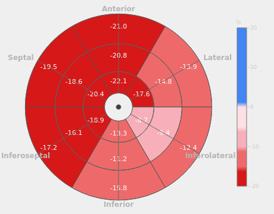
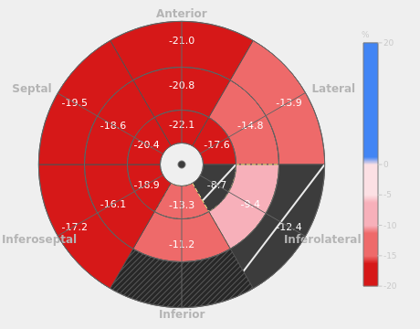
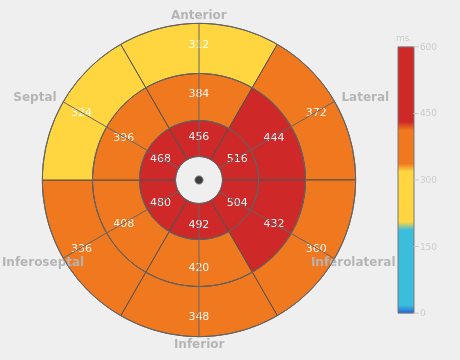

# ПЛАН РАЗВИТИЯ МОДУЛЯ SPECKLE TRACKING ECHOCARDIOGRAPHY (STE) ДО КОММЕРЧЕСКОГО УРОВНЯ

> **Версия:** rev.4 (rev.3 + §5.2 «Состояние реализации»: фазы 0–3 закрыты, фаза 4 частично)
> **Дата:** 2026-09-10
> **Статус:** спека действует; реализация идёт в ветке `arena/01a08cb0-sonoforge` — см. §5.2 для
> построчного статуса и списка того, что осталось. Решения приняты (§11.1), открытые вопросы — §11.2.
> **Область:** `domain/services/{speckle_tracking,border_tracking,strain_computation,aha_segments,tracking_smoothing}.py`,
> `domain/models/speckle.py`, `application/workers/speckle_worker.py`, `application/app_controller.py`,
> `ui/strain_window.py`, `ui/strain_curves_view.py`, `presentation/*`, `infrastructure/locales/*`
> **Тестовые материалы (машина автора, в контейнере отсутствуют):**
> `/home/areatu/ECHO2026_src/Test_vendors/Philips/IM_0059` (46 кадров, 600×800, ~46.5 fps, 0.449 мм/пиксель, есть ECG),
> `IM_0051`, `strain_example/US003900.dcm`, `US006700.dcm`.
>
> **rev.1 → rev.2, главное:**
> 1. rev.1 предлагал считать GLS как **среднее пиков сегментов, взятых в разные моменты времени**. Это **прямо противоречит**
>    консенсусу EACVI/ASE/Industry Task Force («Calculations which average peak values obtained at different points in time
>    are not compatible with the aforementioned definition»). Заменено на согласованные определения (§3.4).
> 2. Найден **главный геометрический дефект**, которого не было в rev.1: трекер **замыкает открытую апикальную дугу**
>    (`border_tracking.resample_closed`), из-за чего 15–20 % «миокардиальной линии» — хорда через митральное кольцо
>    (кровь/ЛП), а сегменты и ядра строятся по замкнутому периметру (§2.1).
> 3. Причина #4 rev.1 («нет компенсации вращения → вращение превращается в strain») **математически неверна**:
>    жёсткий поворот — изометрия, длины не меняются, strain не возникает. Показано, что существующая
>    `remove_global_translations` вообще **не влияет** на кривую деформации (вычитается общий вектор) — она только
>    портит визуализацию, убирая физиологический спуск кольца (§2.8).
> 4. Добавлены проверяемые «немые» дефекты: возможное рассогласование ЭКГ↔кадры (DICOM (0018,1060) `TriggerTime`
>    нигде не читается, §2.5), ES = `R + 0.35·RR` вместо AVC (§2.4), bull's eye из 17 сегментов по одному виду (§2.11),
>    три несогласованных определения strain в worker / UI-curves / экспорте (§2.3), QC = NCC×coverage (§2.7).
> 5. Добавлены разделы, которых не было: целевая клиническая модель с определениями и нормативами (§3),
>    единая модель результата `StrainAnalysis` и провенанс (§4.4), синтетический фантом для валидации (§7.1),
>    тесты-инварианты (§7.2), KPI приёмки и «клинические ворота» (§3.7, §7.2), UI-спека вплоть до раскладок и горячих
>    клавиш (§6), интеграция результата в протокол исследования (§5, фаза 3).

**rev.2 → rev.3, главное:**
> 1. Зафиксированы решения по четырём вопросам §11: параллельные треки «алгоритм + UI» (§5.1),
>    3 вида доступны сразу с возможностью анализа по одному, палитра по умолчанию — GE/EchoPAC, эталоны —
>    по мере передачи клипов.
> 2. Добавлено приложение F: разбор референсных интерфейсов GE EchoPAC AFI и Philips AutoStrain по
>    приложенным скриншотам (раскладка, легенды кривых, две мишени strain/TTP, селектор слоя, числовой блок).
> 3. UI-спека уточнена по референсам: строка per-view GLS + Avg, обязательные две мишени, селектор слоя
>    Endo/Mid, colorbar −20…+20, кривые в стиле GE (3 панели с подписанными легендами и линией AVC).
> 4. Клипы Google Drive из рабочей песочницы недоступны (домен `drive.google.com` закрыт) — нужен перенос
>    через вложения чата или репозиторий, см. §11.2.

---

## 1. TL;DR (для нетерпеливых)

1. **Движок трекинга менять не нужно** — NCC block matching с пирамидой и субликсельной параболой работает;
   ломается не трекинг, а **измерительная схема** вокруг него.
2. **Модуль сейчас не может применяться клинически** не потому, что «мало точности», а потому, что
   **выдаваемое число GLS не является определённой клинической величиной**: неизвестны база (ED), окно (ES/AVC),
   линия (замкнутый периметр с хордой МК), сегменты (углы от центроида), а «качество» измеряет только совпадение
   спеклов, а не корректность измерения.
3. **«Качество 95 %» и правильный GLS — независимы.** QC нужно разделить на *fidelity* (совпадение) и *validity*
   (корректность измерения), с итоговым статусом `Валидно / Требует проверки / Не валидно` и списком причин.
4. **Ядро усиления — анатомическая геометрия**: митральное кольцо + верхушка (в приложении уже есть
   `Contour.mitral_annulus`, `Contour.apex_landmark`, `contour_geometry.apex_point/long_axis_endpoints`),
   из них — длинная ось, 3 уровня, 2 стенки вида, **открытая** материальная линия annulus→apex→annulus,
   18-сегментная модель по стандарту.
5. **Одно определение strain на всё приложение.** Иначе цифры в bull's eye, на кривых, в таблице и в экспорте
   всегда будут расходиться (сейчас это так и есть: три разных алгоритма).
6. **Честный bull's eye**: сектор либо посчитан, либо заштрихован «нет данных». Никогда не рисовать 18/17 сегментов
   из одного вида. Это ровно то, что видит пользователь как «GLS неправильный».
7. **UI** строится как у вендоров: лента результата с крупным GLS, фокусный cine с цветной полосой деформации
   по эндокарду, вкладка кривых, bull's eye + таблица сегментов, общий ECG-strip с маркерами ED/ES/AVC,
   вкладка отчёта; режимы «Focus» и «Quad»; правка landmarks с перерасчётом.
8. **Три вида — цель, а не бонус**: только 3 апикальных вида дают 18 сегментов и GLS, сопоставимый с вендорами
   (`GLS_AV` = среднее пиковых GLS трёх видов). Первая итерация может быть односмотровой, но архитектура — сразу
   многосмотровая.
9. **Валидация до кода**: кинематический фантом с известной деформацией + инварианты (жёсткий сдвиг/поворот не
   меняют GLS) + вендорские эталоны. Без этого невозможно доказать, что стало лучше, а не просто иначе.
10. **Запрещено подгонять числа под ожидание** (physiology prior остаётся выключенным по умолчанию; любые
    «ожидаемые» значения — только в QC-флагах, никогда в значениях).

---

## 2. Диагноз: перепроверенные и новые причины

### 2.0 Резюме: «качество» ≠ «валидность»

Сейчас пользователю показывается `qc_score ≈ NCC × доля принятых ядер`. Это **достоверность сопоставления
спеклов**, а не корректность измерения. Кадр, в котором ядро уверенно (NCC 0.98) отследило *не тот* объект
(клапан, кровь в полости, соседняя структура), даёт максимальный QC при грубо неверной деформации.
Отсюда жалоба «GLS определяется неправильно, даже если указанное качество более 95 %» — это не баг числа QC,
это отсутствие проверок валидности (§2.7, §4.2).

Ниже перечислены причины в порядке вклада. Вклад оценён экспертно по коду и геометрии; часть подлежит измерению
на фантоме и на `IM_0059` в фазе 0.

---

### 2.1 C1 (главная). Апикальная дуга замыкается в контур → в «миокард» попадает хорда митрального кольца

**Где:** `domain/services/border_tracking.py:36` (`resample_closed`), используется в
`propagate_wall_borders` (`:146`, вызовы на `:171–172`) и в `build_border_kernels` (`:79–80`).
`propagate_wall_borders` — **режим по умолчанию** (`SpeckleConfig.preset_standard().tracking_mode == "border"`).

**Что происходит.** Контур ЛЖ в апикальной позиции — **открытая дуга** от септальной точки фиброзного кольца
через верхушку к латеральной (`Contour.is_open_arc == True`, `closed_polygon_points()` достраивает хорду для
Simpson). `resample_closed` добавляет первую точку в конец, то есть замыкает дугу **прямой хордой через полость**
и ресемплит 64 узла по **периметру** этого замкнутого контура. Дальше:
* ядра слоёв endo/mid/epi строятся **вдоль хорды** — то есть в полости ЛЖ и вдоль митральной плоскости;
* `_smooth_contour` (`:106`) сглаживает по кругу `(i + off) % n`, поэтому крайние (прикольцевые) узлы дуги
  усредняются с узлами хорды — смазываются именно базальные отделы;
* `_clamp_outward` (`:286`) клампит радиусы относительно `lv_center = mean(endo)` замкнутого контура;
* продольная деформация считается по **периметру**, включающему хорду
  (`compute_weighted_longitudinal_strain_gl`, `strain_computation.py`).

**Влияние.** Для типичного A4C: дуга эндокарда ≈ 16–18 см, диаметр кольца ≈ 3.0–3.5 см, то есть хорда —
**15–20 % длины «миокардиальной линии»**. Хорда не является миокардом и укорачивается иначе (сужение кольца
~10 % против ~20 % у миокарда), что даёт систематическое **смещение GLS в сторону меньшей |деформации|
на ~1.5–2 п.п.** Но гораздо хуже то, что базальные узлы дуги смешаны с узлами хорды — именно в базальных
сегментах, где вендоры дают наименьшую деформацию и где находится основная диагностическая информация.
Дополнительно: «ядра миокарда» на хорде трекаются по крови/створкам — высокий NCC при бессмысленном смещении.

**Как исправить.** Ввести `resample_open_arc` (без замыкания) и работать с открытой дугой: узлы annulus→apex→annulus,
64 узла по дуге (≈ 5–6 px), сглаживание — с отражением на концах (не по кругу), клампы — по нормалям дуги,
а не по радиусу от центроида. Хорда используется только для замыкания полигона площади (Simpson), в деформации
не участвует. **Фаза 1.**

---

### 2.2 C2. AHA-сегменты назначаются углом от центроида, бины асимметричны, вид жёстко «A4C»

**Где:** `domain/services/aha_segments.py:28–46` (`_a4c_angle_to_segment`), `:49` (`if view != "A4C": return`),
`application/workers/speckle_worker.py:248` и `:417` (`view="A4C"` жёстко), `:113–118`
(`lv_center = mean(self._zone.endo_points)`).

**Что не так:**
* сегмент определяется **углом точки относительно центроида облака точек**, а не положением вдоль длинной оси;
  «базальный», «средний», «апикальный» — это угловые секторы, а не уровни. Один сектор свободно содержит и
  базальные, и апикальные узлы;
* границы секторов **неравномерны**: 4 сектора по 60°, два — по 30° (`:38–40`), то есть «апикальные» сегменты
  5–6 имеют заведомо другой вес;
* названия уровней присваиваются по порядку обхода, который зависит от ориентации изображения (верхушка вверху
  или внизу), от асимметрии контура и от того, с какой точки пользователь начал рисовать. Названия фактически
  перемешиваются;
* вид жёстко `"A4C"` для всех исследований, поэтому A2C/A3C-панели всегда «Нет данных».

**Влияние.** Все сегментальные значения (и производные от них «A4C/A2C/DAO ГлобПродДеф» в сводной таблице)
не имеют анатомического смысла. GLS, если он берётся как среднее сегментов (`choose_clinical_gls`), тоже.
При этом NCC остаётся высоким — картина «95 % и неверный GLS».

**Как исправить.** Сегментация — только из геометрии `LVFrame` (кольцо, верхушка, длинная ось, §3.3), взятой из
landmarks контура. Никаких углов от центроида. **Фаза 1.**

---

### 2.3 C3. Три разных определения strain в трёх местах приложения

| Где | Что считается | Чем отличается |
|---|---|---|
| `speckle_worker.py:471` → `compute_weighted_longitudinal_strain_gl` | длина **всех** эндо-ядер в порядке списка (замкнутый периметр), взвешенная NCC | «глобальная кривая» |
| `speckle_worker.py:525–532` | попарные расстояния ED→ES, **одно значение присваивается двум соседним ядрам** | скалярный `per_kernel` |
| `ui/strain_curves_view.py:446+` | пересчёт по `tracked_positions_all`, с сортировкой ядер `sorted(..., key=(x, y))` (`:478`, `:485`, `:496`) | **растровый порядок**: соседние в списке точки могут стоять на противоположных стенках, между ними учитывается хорда через полость → длина и деформация искажены |

**Влияние.** Значение в bull's eye, значение на кривой и «GLS» в шапке — это три разные величины. Даже если
исправить арифметику в одном месте, пользователь увидит расхождение. Плюс `per_kernel` теряет разрешение
(два ядра = одно значение) и делает сегментальные средние зависимыми от того, на какой границе сегмента
оказалась пара.

**Как исправить.** Единый `StrainEngine` (§4.2) + модель `StrainAnalysis` как единственный источник правды;
UI **не пересчитывает** деформацию. **Фаза 0 (быстрый мостик) и Фаза 2 (полностью).**

---

### 2.4 C4. База (ED) и окно (ES) — источники систематического смещения |GLS|

**Где:** `domain/services/ecg_ed_es_mapper.py:57–71`: ED = кадр, ближайший к R-зубцу; ES = `R + 0.35·RR`;
`strain_computation.py:78–99` (`compute_gls` = `min` кривой на `[ED..ES]`);
`speckle_worker.py:462–477` (окно трекинга = `[min(ED,ES)..max(ED,ES)]`, база L0 — **первый кадр окна**).

**Что не так:**
* ES = фиксированная доля RR. Реальная систола (до закрытия аортального клапана, AVC) — 30–45 % RR и зависит от ЧСС
  и сократимости. Если окно обрезано раньше AVC, `min` берётся **до** истинного пика → |GLS| занижается;
  если позже — в окно попадает постсистолический пик и диастолический подъём;
* ED = кадр у R-зубца, а не «кадр перед закрытием митрального клапана» (определение ED у Task Force). Смещение
  на 1–2 кадра уже сдвигает базу;
* L0 берётся из первого кадра окна трекинга; сейчас это совпадает с ED, но само определение «база = начало
  окна» хрупкое: любая ошибка ED (или расширение окна на полный цикл) немедленно смещает результат.
  В целевой модели база — **всегда кадр ED**, независимо от границ окна;
* GLS вычисляется как минимум на окне, значит любая ошибка ES проецируется в результат, а не в диагностику.

**Как исправить.** Явная политика времени (§3.1): ED — по ЭКГ/маркеру пользователя, L0 — всегда из ED;
«пиковая» метрика — минимум на **[ED … ED + 0.55·RR]** (широкое окно, ловит постсистолический пик и помечает его);
ESS — значение в кадре AVC; AVC — детектор (см. ниже) с приоритетом источников и **явной подписью источника
в UI и в экспорте**. Пользователь должен уметь перетащить ED/ES/AVC. **Фаза 2.**

---

### 2.5 C5 (гипотеза, требует проверки). ЭКГ может быть рассогласована с кадрами

**Где:** `infrastructure/dicom_waveform_parser.py` (парсит `WaveformSequence`, но **не читает**
`TriggerTime (0018,1060)`, `TriggerSamplePosition (0018,1062)`, время начала записи);
`domain/services/ecg_rpeak_detector.py` → `r_peak_times_ms` отсчитываются **от начала записи ЭКГ**, а
`map_rpeaks_to_frames` (`ecg_ed_es_mapper.py:57–58`) делит их на `frame_time_ms`, то есть **предполагает,
что запись ЭКГ начинается ровно с кадра 0 кино**.

**Почему это важно.** У вендоров ЭКГ пишется с триггером, и сдвиг между началом записи и первым кадром кино
хранится в DICOM (Trigger Time). Если сдвиг не учитывается, ED может оказаться на 1–2 кадра (или, при лишнем
комплексе в записи, на десятки кадров) в стороне. Симптом ровно как в жалобе: трекинг «идеальный», NCC высокий,
а |GLS| заметно смещён, потому что база взята в середине систолы.

**Как проверить (Фаза 0, 1 час).** Для `IM_0059` построить: (а) индекс R-зубца по коду; (б) кадр максимальной
площади полости ЛЖ (по уже сохраняемой кривой Simpson или по ROI); (в) кадр минимальной площади; (г) визуально
клапанную плоскость. Если (а) систематически расходится с (б) — гипотеза подтверждена, в план входит чтение
`TriggerTime`/`TriggerSamplePosition` и калибровка смещения (в т.ч. автоматическая: поиск сдвига, максимизирующего
корреляцию «R-пики ↔ надиры кривой площади»).

---

### 2.6 C6. Предложение rev.1 «GLS = среднее пиков сегментов» противоречит консенсусу

Task Force (Voigt 2015, обновление 2022) прямо указывает: глобальная деформация считается либо по **всей длине
миокардиальной линии**, либо усреднением **значений в один и тот же момент времени** (веса — по длине сегмента
в ED); «расчёты, усредняющие пиковые значения, полученные в разные моменты времени, не совместимы с данным
определением». Усреднение сегментных **пиков** даёт другую величину (обычно более отрицательную) и делает результат
несопоставимым с литературой и вендорами.

**Как исправить.** Считать GLS как пик **глобальной кривой** (по всей линии) — это и есть определение Philips
(«global shortening of the endocardial border, peak value»). Дополнительно считать «среднее 18 сегментных
значений в один кадр» как вторичную величину для сопоставления с публикуемыми нормами, и выводить
расхождение между двумя способами как **метрику самосогласованности** (§3.6). **Фаза 2.**

---

### 2.7 C7. QC = NCC × покрытие: почему «качество 95 %» ничего не гарантирует

**Где:** `speckle_worker.py:610–618` (`qc_overall = tracking_quality_mean * coverage`),
`strain_computation.py:assess_strain_plausibility` (проверяет 3 грубых условия), UI показывает это как «QC 95 %».

**Чего не хватает:**
* проверки **геометрии** (есть ли landmarks, совпадают ли концы дуги с кольцом, не инвертирована ли верхушка,
  правдоподобны ли длина ЛЖ и диаметр кольца — часть проверок уже есть в `lvef_simpson.py:_a4c_apex_inverted`,
  `_contour_annulus_length_px`, `arc_depth/annulus`);
* проверки **согласованности** (линия vs среднее сегментов; хорда vs дуга; пик в окне vs пик за цикл;
  разброс между стенками и между ударами);
* проверки **покрытия по сегментам** (не «доля ядер», а «сколько сегментов имеют ≥ 3 валидных узла»);
* политики исключения сегментов (Task Force: не более **одного** сегмента на вид, воспроизводимо).

**Как исправить.** `domain/ste/quality.py` → статус `valid | review | invalid`, числовой confidence 0–1,
список причин с i18n-ключом и подсказкой «что сделать». Правило: **зелёный статус невозможен**, пока не пройдены
геометрия, покрытие, самосогласованность и физиологичность. **Фаза 3** (минимальная версия — Фаза 0).

---

### 2.8 C8. «Компенсация глобального движения»: не влияет на GLS; вращение вообще не может «превратиться в strain»

**Где:** `speckle_tracking.py:351–386` (`estimate_global_translations` через `cv2.phaseCorrelate` по всему кадру,
`remove_global_translations`), вызов `speckle_worker.py:436–437`.

**Два вывода, важных для плана:**
1. `remove_global_translations` вычитает **один и тот же** вектор из всех ядер кадра. Попарные расстояния
   внутри кадра и, следовательно, длина линии и кривая деформации **не меняются вообще**. То есть шаг
   «global motion compensation» для GLS — **no-op**, а для визуализации — вреден: он убирает реальный
   систолический спуск фиброзного кольца и «плавание» сердца, из-за чего ядра перестают совпадать с анатомией;
2. жёсткий поворот — **изометрия**: расстояния и длины дуг при нём не меняются, поэтому «вращение,
   интерпретируемое как strain» (причина #4 rev.1) невозможно по построению. Реально мешают: **out-of-plane**
   движение, декорреляция спеклов, нежёсткая деформация через плоскость сканирования и ошибки сопоставления.

**Что делать вместо:** (а) не применять глобальную трансляцию к координатам, используемым для деформации
(оставить её только как опцию визуализации — «зафиксировать верхушку/сердце в кадре»);
(б) ввести **фрейм ЛЖ**: начало координат в середине митрального кольца, ось X — вдоль длинной оси;
все траектории хранить и показывать в этом фрейме (аннулус-десцент виден как движение кольца, деформация
считается корректно); (в) при наличии эпикарда/кольца — опциональная робастная (IRLS/RANSAC) подгонка
подобия между кадрами для **визуального** выравнивания, но с обязательным логированием и выключением по умолчанию.

---

### 2.9 C9. «Quality-weighted smoothing» подменяет кадры интерполяцией — это фабрикация деформации

**Где:** `tracking_smoothing.py:155–162`: перед Savitzky-Golay кадры с NCC < 0.5 **заменяются линейной
интерполяцией по кадрам с NCC ≥ 0.5**. Плюс `interpolate_invalid_kernels` (`:29`) восстанавливает позиции
«потерянных» ядер из соседей.

**Влияние.** Кривая деформации в плохих кадрах становится **синтетической** и гладкой, что маскирует провал
трекинга и делает QC оптимистичным. Это прямо противоречит принципу «не выдумывать деформацию» (в этом же файле
`physiology_prior` по умолчанию выключен именно поэтому).

**Как исправить.** Убрать ре-интерполяцию из сглаживания; хранить по каждому узлу/кадру флаг `valid`, не
интерполировать и не сглаживать через невалидные участки (маскированное сглаживание с заполнением только
для визуализации, но с пометкой «интерполировано»); показывать долю интерполированного как отдельную метрику
качества. **Фаза 0.**

---

### 2.10 C10. Анализ только ED…ES: нет SR, PSI, TTP, dispersion и контроля дрейфа

Сейчас `tracking_window = [ED..ES]`, кривая вне окна — `NaN`, дрейф-компенсация отключается
(`speckle_worker.py:478–486`), `strain_rate` считается по «нулям» вместо пропусков (`:508`), а
`compute_strain_rate` — по конечным разностям без сглаживания.

**Влияние.** Нельзя вычислить ни одной из метрик, по которым вендоры и литература отличают паттерны
(гипертрофия, амилоидоз, диссинхрония): время до пика (TTP) и его разброс (mechanical dispersion),
постсистолический индекс (PSI), пиковая скорость раннего/предсердного наполнения, а также невозможно
проконтролировать дрейф по замыканию цикла.

**Как исправить.** Трекать **полный доступный цикл** (от ED до ED + RR, при наличии — 2 удара), окно
анализа — параметр; дрейф оценивать как остаточную ненулевую деформацию в следующем ED (это честная метрика,
а не «компенсация»). **Фаза 2.**

---

### 2.11 C11. Bull's eye и сводная таблица показывают данные, которых нет

**Где:** `ui/strain_window.py:BullseyeWidget` (рисует 17 секторов), `show_result` (~`:1395–1410`) —
«per-view GLS» из диапазонов ключей сегментов; `SummaryTable` (9 строк).

**Что не так:** рисуется полная 17-сегментная мишень, хотя посчитаны 6 сегментов одного вида; остальные
секторы получают цвет «нет данных», но воспринимаются как измеренные. Строки «A2C ГлобПродДеф» и
«ДАО ГлобПродДеф» вычисляются из диапазонов ID сегментов (7–11 и ≥ 12), которые при жёстком `view="A4C"`
**никогда не назначаются**, поэтому всегда пусты, а панели этих видов показывают «Нет данных».
Итог — экран выглядит как полный анализ, хотя измерен один вид: это подрывает доверие к числам.

**Как исправить.** Мишень собирается **из фактически посчитанных сегментов**: несчитанные секторы —
заштрихованы и помечены «нет данных»; для одного вида — мишень вида (6 секторов) + глобальная мишень 18 сегментов
по мере появления видов; строки таблицы появляются только при наличии соответствующего вида. **Фазы 1, 3, 5.**

---

### 2.12 C12. Геометрия миокарда: фиксированная толщина и слои без эпикарда

**Где:** `myocardial_zone.py:create_myocardial_zone` (по умолчанию 8 мм наружу по нормалям от эндокарда),
`sample_kernels_in_zone` (3 кольца × 32), `build_border_kernels` (endо/mid/epi по материальной доле).

**Что не так.** Если пользователь не нарисовал эпикард, «миокард» — это эндокард + 8 мм наружу (в верхушке
стенка тоньше, у кольца — толще и наклонена), поэтому mid/epi-ядра могут оказаться в полости, в предсердии
или в перикарде. При наличии эпикарда полярность иная: глобальная кривая всё равно строится только по
эндо-слою, а радиальная деформация (`compute_weighted_radial_strain_gl`) — по средней толщине endo–epi,
то есть по другому определению, чем то, что заявлено в интерфейсе.

**Как исправить.** Эндокардиальная деформация (как у Philips) — основной и объявленный метод; эпикард при
наличии — для толщины и радиальной деформации; при отсутствии — не фабриковать слои, ограничиться одной
материальной линией с толщиной по умолчанию, помеченной как «приблизительно». Явно указывать метод в отчёте.
**Фаза 1–2.**

---

### 2.13 C13. Нет единой модели результата и провенанса; результат не попадает в протокол

`StrainResult` (`domain/models/speckle.py`) — набор массивов без семантики (нет кривых по сегментам,
нет уровней/стенок, нет качества по сегментам и времени, нет источника ED/ES в машинно-читаемом виде,
нет версии конфигурации). UI дополняет данные своими вычислениями, экспорт JSON/CSV сериализует то, что есть.
Отдельно: **GLS не сохраняется в сессию измерений** (`application/study_measurement_session.py` не знает о strain),
поэтому не попадает ни в протокол, ни в отчёты — для клинического применения это блокер.

**Как исправить.** `StrainAnalysis` (единая модель, версионированная JSON-схема, провенанс) + запись в сессию
исследования + отчёт/worksheet. **Фазы 2–4.**

---

### 2.14 Что НЕ является причиной (чтобы не тратить силы)

* **Алгоритм сопоставления** (NCC + пирамида + параболическая субликсельная интерполяция) — корректен,
  подтверждён измерениями в `docs/speckle_tracking_analysis.md`; менять его в этом милстоуне не нужно.
* **Отсутствие ML** — не причина неверного GLS; сначала геометрия, определения и валидация.
* **«Мало ядер»/«мало кадров»** — при корректной геометрии текущего числа узлов достаточно;
  вопросы чувствительности решаются фантомом, а не «на глаз».
* **Сглаживание как таковое** — Savitzky-Golay корректен; портит именно ре-интерполяция (§2.9).
* **Вращение как источник ложной деформации** — см. §2.8, математически неверно.

### 2.15 Матрица трассируемости: причина → фаза → критерий приёмки

| # | Причина | Фаза | Критерий, что исправлено |
|---|---|---|---|
| C1 | Замкнутая дуга / хорда МК | 1 | Тест: 0 узлов вдоль хорды; длина линии = длине дуги (без хорды) ±0.5 % |
| C2 | Сегменты по углу от центроида | 1 | Тест покрытия/континуальности сегментов; границы уровней = 1/3 и 2/3 длинной оси ±1 px |
| C3 | Три определения strain | 0, 2 | Тест «числа совпадают» worker ↔ UI ↔ экспорт для одного прогона |
| C4 | ED/ES/окно/база | 2 | Фантом: GLS в пределах ±1 п.п.; сдвиг ED на ±2 кадра меняет |GLS| ≤ 1 п.п. |
| C5 | Возможный сдвиг ЭКГ↔кадры | 0 | Отчёт по `IM_0059`: R-пик vs надир площади; при подтверждении — фикс + тест |
| C6 | Среднее пиков (rev.1) | 2 | GLS = пик глобальной кривой; тест на синтетической кривой |
| C7 | QC ≠ валидность | 0, 3 | Все тесты-инварианты §7.2 проходят; статус «валидно» только при них |
| C8 | Ложная роль глобального движения | 2 | Тест: вычитание общего вектора не меняет кривую (документировано и проверено) |
| C9 | Ре-интерполяция кадров | 0 | Тест: кадры с NCC<thr не заменяются; доля интерполяции — отдельная метрика |
| C10 | Только ED…ES | 2 | Полный цикл: TTP/PSI/SR/dispersion считаются, дрейф измеряется |
| C11 | Ложная мишень/таблица | 1, 3, 5 | Тест: число секторов = числу посчитанных сегментов; «нет данных» заштриховано |
| C12 | Геометрия миокарда | 1, 2 | Отчёт явно указывает метод (endocardial); слои не фабрикуются |
| C13 | Нет модели/протокола | 2–4 | JSON-схема + запись в сессию + строка в отчёте |

---

## 3. Целевая клиническая модель

### 3.1 Определения (по Voigt 2015 / 2022, согласованы с Philips/TomTec/GE)

| Термин | Определение, которое мы реализуем |
|---|---|
| **ED** | Кадр перед полным закрытием митрального клапана (суррогат — начало QRS / R-зубец). **Обязательно показывать источник**: ECG / ручной / Симпсон / изображение. |
| **ES / AVC** | Закрытие аортального клапана. Приоритет источников: (1) ЭКГ + уточнение по кривой (см. ниже), (2) надир кривой площади полости (Симпсон), (3) автоматический ES = время глобального пика деформации (как у Philips), (4) ручной. **Источник печатается** в UI и экспорте. |
| **L0 (база)** | Всегда длина материальной линии в кадре ED. Никогда не «первый кадр окна трекинга». |
| **ESS (end-systolic strain)** | Значение деформации в кадре AVC. **Отчётный параметр по умолчанию** (рекомендация Task Force). |
| **Пиковая систолическая деформация** | Минимум кривой на расширенном окне `[ED … ED + 0.55·RR]`. Показывается как дополнительный параметр с явной подписью. |
| **Пиковая деформация за цикл** | Минимум за весь цикл; если он позже AVC — помечается как «постсистолическая» (PSS). |
| **GLS (вид)** | Пик **глобальной кривой** по всей миокардиальной линии вида (Philips-определение). |
| **GLS (общий)** | Среднее пиковых GLS трёх видов (`GLS_AV`) — основное число. Вторично: среднее 18 сегментных значений в один кадр (для сопоставления с нормами). |
| **Слой** | Эндокардиальная деформация (как Philips AutoSTRAIN). Указывается в отчёте явно. |
| **Знак** | Всегда выводится со знаком; сравнения — по абсолютной величине (Task Force). |
| **Исключение сегментов** | Не более **1 сегмента на вид**, воспроизводимо, с логированием и пересчётом. |

Формулы — в приложении B.

### 3.2 Сегментные модели

**Основная — 18-сегментная** (Voigt 2015, Fig. 3; используется Philips AutoSTRAIN и TOMTEC). Уровни:
6 базальных + 6 средних + 6 апикальных. Апикальные сегменты **повторяют названия** базальных и средних
уровней. В 17-сегментной модели апикальный уровень содержит 4 сегмента + верхушка (17); эта схема сохраняется
для сопоставления с визуальной оценкой локальной сократимости, перфузии и коронарных бассейнов
(российские рекомендации 2024 г. рекомендуют 17-сегментную схему именно для схемы нарушений сократимости).

**Распределение видов** (каждый вид даёт 6 сегментов = 2 стенки × 3 уровня; три вида покрывают 18 сегментов
ровно один раз):

| Вид | 1-я стенка (basal/mid/apical) | 2-я стенка (basal/mid/apical) |
|---|---|---|
| A4C (4-камерная) | inferoseptal: 3 / 9 / 15 | anterolateral: 6 / 12 / 18 |
| A2C (2-камерная) | anterior: 1 / 7 / 13 | inferior: 4 / 10 / 16 |
| A3C (3-камерная, она же LAX/DAO) | anteroseptal: 2 / 8 / 14 | inferolateral: 5 / 11 / 17 |

Нумерация базальных/средних сегментов 1–12 совпадает с AHA. Для апикального уровня в 17-сегментной
терминологии: A4C → 14 (apical septal) и 16 (apical lateral); A2C → 13 (apical anterior) и 15 (apical inferior);
A3C → апекс-септальный и апекс-латеральный. **При конфликте названий менять только таблицу отображения,
не геометрию.** Имена и сокращения — в i18n (`strain.seg18.*`), цвета сегментов — единые для мишени,
таблицы и кривых.

### 3.3 Геометрия: уровни, стенки, материальная линия

Вход: `Contour` вида с `mitral_annulus = (P0, P1)` и (опционально) `apex_landmark`; контур — открытая дуга,
`points[0]` примыкает к `P0`, `points[-1]` — к `P1` (проверено по `viewer_widget`/`closed_polygon_points`).

1. **Длинная ось:** `M = (P0 + P1)/2`, `A = apex` (если `apex_landmark` нет — узел дуги, максимально удалённый
   от прямой `P0P1`; при сомнении — автоопределение + предупреждение), `u = (A − M)/|A − M|`, `L = |A − M|`.
2. **Материальная линия:** дуга ресемплится на `N = 64` узла **равной длины по дуге в ED** (без замыкания);
   `k` — индекс узла, ближайшего к апексу (`apex_index`). Тогда стенка = `i < k` → первая стенка вида,
   `i ≥ k` → вторая (никаких перекрестных назначений; строго континуальные участки).
3. **Уровень:** `t = clamp(((x_i − M)·u)/L, 0, 1)`; `t < 1/3` — базальный, `< 2/3` — средний, иначе апикальный.
   Дополнительно контролируется дуговая доля `s` от кольца до апекса; при расхождении > 0.15 — предупреждение
   (сильно изогнутая верхушка/нетипичная геометрия), уровень берётся по `t` (стандарт — трети длинной оси).
4. **Сегмент** = максимальный непрерывный набор узлов с одинаковой парой (уровень, стенка).
5. **Веса** сегмента = доля длины сегмента на дуге в ED (для равноотстоящих узлов — равные).
6. **Валидация:** `P0`,`P1` совпадают с концами дуги (±5 px), `2.0 см ≤ |P0P1| ≤ 4.5 см`,
   `7 см ≤ L ≤ 12.5 см`, верхушка не «инвертирована» (переиспользовать логику `lvef_simpson._a4c_apex_inverted`),
   `arc_depth/annulus ≥ 0.5`, дуга не самопересекается, каждый сегмент ≥ 3 узлов.
7. **Ориентация/флип:** каждой паре стенок вида сопоставлены *анатомические* имена только при известной
   ориентации изображения; поддерживается флаг «инверсия ЛЖ» (требование Task Force), автоопределение +
   ручное переключение. Ошибка ориентации не должна менять GLS, но обязана менять названия сегментов.

### 3.4 Формулы (основные)

* Узловая (локальная) деформация, Green–Lagrange вдоль линии: `E_i(t) = 0.5·((L_i(t)/L_i(0))² − 1)·100 [%]`,
  где `L_i` — длина 3-узловой поддуги `x_{i−1}…x_{i+1}` через `x_i` (основной вариант; хорда `|x_{i+1} − x_{i−1}|` —
  вторичный, для проверки чувствительности к кривизне).
* Кривая сегмента: `E_seg(t) = Σ_i w_i·E_i(t) / Σ_i w_i` (усреднение **в один момент времени**; веса — по ED).
  ESS/пик сегмента читаются **из кривой сегмента**, а не из пиков узлов.
* Глобальная кривая вида: (A) по всей линии `E_gl(t) = 0.5·((L_total(t)/L_total(0))² − 1)·100`, где `L_total` —
  длина открытой дуги; (B) `Σ_seg w_seg·E_seg(t) / Σ_seg w_seg`. Основной результат — (A);
  `|(A) − (B)|` — метрика самосогласованности.
* GLS вида = min глобальной кривой на `[ED … ED + 0.55·RR]`; ESS = значение при AVC.
* `GLS_AV = mean(GLS_A4C, GLS_A2C, GLS_A3C)`.
* Strain rate: производная по времени от кривой, после савицки-голаевского сглаживания по времени
  и пересэмплирования кривых на равномерную сетку (например, 100 Гц) — так пики SR не «прыгают» по кадрам.
* TTP: время от ED до минимума кривой сегмента (мс и в долях RR). **Mechanical dispersion** = SD(TTP) по 18 сегментам.
* PSI (post-systolic index) = `100·(|E_peak| − |E_AVC|)/|E_peak|` — положительный, если пик наступает
  после AVC (то есть деформация продолжает нарастать в постсистолу).
* MAPSE — вертикальное смещение середины митрального кольца (из landmarks, мм) — бесплатный бонус, который
  вендоры показывают рядом с GLS.
* Apical sparing = `|GLS_апикальных| / |GLS_базальных|` (справочно, с подписью «информационно»).

### 3.5 Метрики модуля

| Метрика | Где считать | Фаза | Примечание |
|---|---|---|---|
| GLS вида, GLS_AV, ESS, пиковый GLS | StrainEngine | 2 | основные |
| Кривые 18 сегментов, параметр по сегменту | StrainEngine | 2 | единый источник для UI и экспорта |
| SR (S/E/A), TTP, PSI, dispersion, apical sparing | StrainMetrics | 2 | требуют полного цикла |
| MAPSE, кольцевое смещение | LVFrame + трекинг кольца | 2 | из landmarks |
| Bull's eye strain + TTP | UI | 3–4 | TTP-мишень как у Philips (белый = ES, синий = раньше, красный = позже) |
| QC/confidence, покрытие, доля интерполяции | quality.py | 3 | статус + причины |
| EF/EDV/ESV, HR, ЗАК | сессия измерений | 3 | из Симпсона/ЭКГ, а не из FFT кино |
| LA strain (reservoir/conduit/contraction), RV GLS | отдельный милстоун | 6 | следующий по клинической ценности модуль |

### 3.6 Нормативы и интерпретация

* Заключения оформляются **флагами с ссылкой на источник**, без «диагнозов»:
  `|GLS| ≥ 18 %` — норма; `16–18 %` — пограничное; `< 16 %` — снижение (JACC Cardio-Oncology 2020;
  ориентир среднего значения у взрослых ≈ 19.7 %, 95 % ДИ 18.9–20.4). Все пороги — по абсолютной величине.
* Нормы и пороги хранятся в одном месте (`ase_reference_norms.py`-совместимо), с указанием источника,
  пола/возраста (если решим добавить — по EACVI NORRE), и **никогда не подставляются молча**:
  под числом всегда подпись «референс: …».
* Запрет: «коррекция» значения под ожидаемую норму. Физиологические приоры — только в QC-флагах.

### 3.7 KPI приёмки модуля (клинические ворота)

1. **Фантом:** |ΔGLS| ≤ 1.0 п.п. при однородной деформации −20 %, ≤ 2.0 п.п. при градиенте apex↔base;
   сегментный RMS ≤ 2.5 п.п.; TTP ≤ 1 кадр.
2. **Инварианты:** жёсткий сдвиг ±15 px и поворот ±10° меняют GLS ≤ 0.5 п.п.; нулевая деформация → GLS ≈ 0 ± 0.5.
3. **Вендорское сопоставление** (при наличии чисел): bias ≤ 1.5 п.п., LoA ≤ ±3 п.п., r ≥ 0.9 на ≥ 20 клипах.
4. **Воспроизводимость:** повторный прогон даёт бит-в-бит одинаковый результат; ICC между двумя операторами ≥ 0.9.
5. **Скорость:** 1 вид ≤ 8 с, 3 вида ≤ 25 с на 4-ядерном CPU (без GPU).
6. **Отчёт:** значение + определение (ESS/пик) + слой + источник ED/ES + покрытие + QC + версия/конфиг.
7. **UI-чеклист** §6 пройден полностью (включая связку мишень↔кривые↔cine, правку landmarks, «нет данных»).

### 3.8 Что даёт усиление поверх вендоров

Точность уровня вендора — необходимый минимум, а не цель. Возможности, дешёвые для нас и дорогие для
проприетарных пакетов, которые стоит заложить сразу:

1. **Честная неопределённость:** доверительный интервал GLS (bootstrap по сегментам и разброс между ударами)
   вместо одного числа. Вендоры обычно показывают число без интервала.
2. **Самовалидация:** самосогласованность (линия vs сегменты), инварианты жёсткого движения, покрытие —
   отчёт «почему этому числу можно верить», а не только NCC.
3. **Полный провенанс:** JSON с версией, конфигом, источником ED/ES/AVC, слоем, списком исключённых сегментов —
   воспроизводимость на уровне исследования (нужно для научных работ и для разбора инцидентов).
4. **Пакетный анализ без GUI** (CLI + JSON) — массовая обработка наборов исследований, чего нет у вендоров.
5. **Расширенный региональный пакет в один клик:** мишень TTP + mechanical dispersion + PSI + apical sparing +
   MAPSE — у части вендоров это отдельные модули и лицензии.
6. **Следующие по клинической ценности модули** — LA strain (reservoir/conduit/contraction) и RV FWLS —
   строятся на той же геометрии и том же движке (Фаза 6).

---

## 4. Архитектура

### 4.1 Поток данных

```
Contour(LV, открытая дуга, MA, apex) ──┐
ECG + Simpson area curve ──────────────┤
                                        ▼
                       ┌──────────────────────────────┐
                       │  TimeBase (ED/ES/AVC/RR)     │  §3.1
                       └──────────────┬───────────────┘
                                      ▼
                       ┌──────────────────────────────┐
                       │  LVFrame (ось, уровни, стенки)│ §3.3
                       └──────────────┬───────────────┘
                                      ▼
   трекер (без изменений ядра!)  ─────────────►  MaterialLine (N узлов, открытая дуга)
                                      ▼
                       ┌──────────────────────────────┐
                       │  StrainEngine → StrainMetrics │ §3.4
                       └──────────────┬───────────────┘
                                      ▼
                       ┌──────────────────────────────┐
                       │  Quality → StrainAnalysis     │ §4.4   (единственный источник правды)
                       └───────┬──────────────┬────────┘
                               ▼              ▼
                         UI (все окна)   сессия/отчёт/экспорт (JSON/CSV/PNG/PDF)
```

### 4.2 Новые доменные модули (`src/echo_personal_tool/domain/ste/`)

| Модуль | Ответственность | Ключевые функции |
|---|---|---|
| `lv_frame.py` | Анатомический фрейм ЛЖ из landmarks + валидация | `LVFrame.from_contour(contour, pixel_spacing)`, `validate() -> list[Issue]`, `long_axis_param(p)`, `level_of(i)`, `wall_of(i)`, `apex_index`, `to_frame(points)` |
| `segment_map.py` | 18/17-сегментные модели, распределение по видам, имена/цвета | `SEGMENTS_18`, `VIEW_WALLS`, `assign(material_line, frame) -> SegmentMap`, `segments_for_view(view)` |
| `material_line.py` | Открытая материальная линия из дуги | `resample_open_arc(points, n)`, `apex_index(points, ma)`, `partition_nodes(frame) -> list[NodeRef]`, `segment_weights()` |
| `strain_engine.py` | Все кривые и значения (одно определение) | `node_curves(positions)`, `segment_curves()`, `global_curve()`, `meas(metric, window)`, `strain_rate()`, `ttp()`, `psi()`, `dispersion()` |
| `time_base.py` | ED/ES/AVC/RR, источники, правка | `TimeBase.resolve(ecg, area_curve, strain_curve, manual)`, `source_label()` |
| `quality.py` | Fidelity + validity + confidence + причины | `assess(analysis) -> QualityReport(status, score, reasons)` |
| `analysis.py` | `StrainAnalysis` (модель + JSON-схема + провенанс) | `StrainAnalysis.to_json()`, `from_json()`, `schema_version`, `config_hash` |
| `study.py` | Многосмотровое исследование | `StrainStudy.add_view`, `gls_av`, `bullseye_18`, `segments_table` |

**Совместимость:** `domain/services/aha_segments.py`, `strain_computation.py` остаются как тонкие обёртки
(их тесты — `tests/unit/test_aha_segments.py`, `test_strain_computation.py` — должны продолжать проходить);
старые функции помечаются `deprecated`, но не удаляются в этом милстоуне.

### 4.3 Изменения в пайплайне `SpeckleTrackingWorker`

1. Вход: `Contour` (не `MyocardialZone`) — воркер сам строит `LVFrame` и `MaterialLine`;
   совместимость: при переданной зоне поведение прежнее (legacy-ветка под фича-флагом).
2. Окно трекинга: `[ED … min(last, ED+RR)]` (полный цикл); окно анализа — отдельно.
3. Режим `border`: **не замыкать** дугу; бордер-точки annulus/apex трекать как отдельные узлы
   с приоритетом (они же — landmark-контроль дрейфа).
4. `global_motion_compensation`: не применять к данным деформации (§2.8); оставить как визуальную опцию.
5. Убрать ре-интерполяцию кадров (§2.9); `valid`-маски пробрасывать во все сглаживания.
6. Шаги: encode → time base → geometry → track (border/sequential/bidirectional) → strain → quality.
   Каждый шаг — с прогрессом и обработкой `cancel`.
7. Кэш: результат по ключу `(sop_instance_uid, view, config_hash)` — повторный просмотр без пересчёта;
   кнопка «Пересчитать».

### 4.4 Модель `StrainAnalysis` (единый источник правды)

```python
@dataclass(frozen=True)
class StrainAnalysis:
    schema_version: str            # "2.0"
    study_uid: str | None
    view: str                      # A4C | A2C | A3C
    method: str                    # "endocardial_green_lagrange"
    pixel_spacing: tuple[float, float]
    frame_time_ms: float
    time_base: TimeBaseInfo        # ed, es, avc, rr, source, confidence
    geometry: LVFrameInfo          # ma, apex, length_mm, annulus_mm, warnings
    line: np.ndarray               # (N, 2) материальные точки в ED
    positions: np.ndarray          # (T, N, 2) в пикселях (image coords)
    valid: np.ndarray              # (T, N) bool
    ncc: np.ndarray                # (T, N)
    node_curves: np.ndarray        # (T, N) %
    segment_curves: dict[int, np.ndarray]   # seg_id -> (T,) %
    global_curve: np.ndarray       # (T,) %
    metrics: dict[str, float | dict]        # gls, ess, peak, ttp, psi, dispersion, sr_*, mapse
    segments: dict[int, SegmentInfo]        # name, level, wall, quality, accepted, excluded
    bullseye: dict[int, float]
    quality: QualityReport
    provenance: Provenance         # app_version, config_hash, created_at, operator, sources
```

Требования: JSON-схема с `schema_version`; экспорт CSV/PNG/PDF/JSON из одной модели; запись в
`study_measurement_session` (GLS + per-view + QC) для протокола и отчётов.

---

## 5. Дорожная карта

Оценки — рабочие дни одного разработчика. Порядок выбран так, чтобы каждая фаза давала **проверяемое**
изменение точности, а не «переписали и стало красивее».

| Фаза | Приоритет | Оценка | Результат |
|---|---|---|---|
| 0. Честность и диагностика | P0 | 2–3 д | Числа в UI/экспорте совпадают; QC не врёт; подтверждена/опровергнута гипотеза C5 |
| 1. Геометрия ЛЖ и сегменты | P0 | 4–6 д | Открытая дуга, уровни/стенки, 18-сегментная карта, валидатор |
| 2. Ядро расчёта | P0 | 6–9 д | Кривые/метрики по стандарту, полный цикл, фантомная валидация |
| 3. QC + модель + протокол | P1 | 4–6 д | `StrainAnalysis`, статусы валидности, отчёт/worksheet, экспорт |
| 4. UI-паритет | P1 | 8–12 д | Ribbon, cine v2, bull's eye v2, кривые, таблица, ECG/transport, Report |
| 5. 3 вида | P1/P2 | 4–6 д | `GLS_AV`, 18 сегментов, сравнение видов, batch CLI |
| 6. Расширения | P3 | — | LA/RV strain, multi-beat + CI, плотное поле, ML (NELAFO) |

### 5.1 Два параллельных трека (решение принято 2026-09-10)

Разработка ведётся двумя треками одновременно; связь между ними — **контракт данных** `StrainAnalysis`
(§4.4), а не общий код.

* **Трек A (алгоритм и данные):** фазы 0 → 1 → 2 → 3 — геометрия ЛЖ, единый движок деформации, метрики,
  QC, модель результата, протокол/экспорт.
* **Трек B (UI):** фаза 4 — каркас `ui/ste/`, лента результата, cine v2, мишени, кривые, ECG/transport,
  редактор landmarks, вкладка отчёта.
* **Стык:** весь UI читает данные только через адаптер `ui/ste/model_adapter.py`. Пока трек A не отдал v2,
  адаптер работает на текущем `StrainResult`; после — переключается на `StrainAnalysis`, экраны не переписываются.
  Тест `test_ste_consistency.py` (фаза 0) постоянно проверяет, что числа UI равны числам модели.

| Итерация | Трек A | Трек B |
|---|---|---|
| 1 (≈неделя) | 0.1–0.3: честный QC, единые числа, запрет ре-интерполяции | каркас `ui/ste/`, тема, скелет ленты, адаптер модели |
| 2 | 1: `lv_frame` / `segment_map` / `material_line`, открытая дуга | мишень v2 (штриховка «нет данных», colorbar, палитра GE, hover/click), таблица сегментов |
| 3 | 2: `strain_engine` / `time_base` / метрики, фантом + инварианты | cine v2: полоса деформации по эндокарду, ядра с QC, подписи сегментов, ED/ES-контуры, векторы |
| 4 | 3: `quality`, `StrainAnalysis`, протокол, экспорт | кривые в стиле GE, ECG-strip + transport, редактор landmarks, вкладка Report |
| 5 | 5: 3 вида, `GLS_AV`, batch CLI | Quad-режим, мишень TTP, сравнение видов |

**Риск параллельности** — расхождение контрактов и двойная работа. Меры: адаптер, замороженная JSON-схема
с итерации 1, тест согласованности чисел, обязательный прогон общего набора тестов перед каждой итерацией.

### Фаза 0 — «Остановить кровотечение» + диагностика (P0)

* **0.1** Разделить QC: `tracking_fidelity` (NCC) и `qc_validity`; в UI убрать зелёный ярлык «качество 95 %» →
  «Слежение: NCC 95 % (точность не гарантирована)»; показать `qc_score` только вместе со статусом валидности.
* **0.2** Быстрый мостик: worker отдаёт в `StrainResult` `segment_curves` (считает сам, по корректному порядку
  узлов), UI-кривые берут их; удалить растровый пересчёт (`strain_curves_view.py:478,485,496`).
* **0.3** Убрать ре-интерполяцию кадров (`tracking_smoothing.py:155–162`); добавить метрику «доля
  интерполированных кадров».
* **0.4** Мишень: рисовать только фактически посчитанные сегменты (до внедрения 18-сегментной модели — 6 секторов
  текущего вида + подпись «вид не проанализирован» для остальных); в сводной таблице не выводить строки видов,
  которых нет.
* **0.5** Диагностический прогон `IM_0059`: JSON+PNG артефакты (позиции узлов, кривые, маски, ED/ES, R-пики,
  кривая площади), проверка C5 (сдвиг ЭКГ↔кадры), измерение хорды (доля периметра), проверка C4.
* **Тесты:** `test_ste_consistency.py` (числа UI == числа модели), `test_smoothing_no_interp.py`,
  `test_bullseye_only_measured.py`.
* **Приёмка:** (1) тесты зелёные; (2) отчёт по `IM_0059` с указанием, подтвердилась ли C5;
  (3) ни один экран не показывает «качество», не сопровождённое статусом валидности.

### Фаза 1 — Геометрия ЛЖ и сегментация (P0)

* `lv_frame.py`, `segment_map.py`, `material_line.py` (§4.2), тесты на синтетических контурах
  (дуги с известной геометрией, разные ориентации, инвертированная верхушка, асимметрия).
* Воркер: `resample_open_arc` вместо `resample_closed` в бордер-трекинге; сглаживание концов — зеркальное;
  кламп — по нормалям дуги; хорда исключена из всех расчётов деформации.
* UI: подписи сегментов в cine берутся из `SegmentMap` (а не из углов), цвет и имя согласованы с мишенью;
  мишень одного вида — 6 секторов на правильных анатомических позициях.
* **Тесты:** покрытие (каждый узел ровно в одном сегменте), континуальность (сегменты — непрерывные участки
  дуги), границы уровней (1/3, 2/3 ±1 px), `apex_index` устойчив к перевороту изображения, валидатор ловит
  инвертированную верхушку и несовпадение концов дуги с кольцом, 0 узлов на хорде.
* **Приёмка:** на `IM_0059` визуально: ядра не выходят на хорду/в полость; подписи сегментов совпадают
  с анатомией; тест «числа не зависят от порядка обхода контура».

### Фаза 2 — Ядро расчёта деформации (P0)

* `strain_engine.py`, `time_base.py`, `strain_metrics.py`; единое определение strain (§3.4).
* Полный цикл трекинга + окно анализа; дрейф измеряется, а не «компенсируется».
* AVC-детектор: ЭКГ (адаптивная доля RR при отсутствии иной информации) → надир кривой площади (Симпсон) →
  время глобального пика деформации (Philips-стиль) → ручной; приоритет настраиваемый, источник обязателен.
* Синтетический фантом (§7.1) + инварианты (§7.2); CI-бенч на 1 вид.
* **Приёмка:** все KPI §3.7 п.1–2, 4–5 зелёные; в экспорте — «ESS» и «пиковый» как отдельные параметры.

### Фаза 3 — QC, модель результата, протокол (P1)

* `quality.py` (fidelity, geometry, coverage, plausibility, самосогласованность, межударный разброс),
  статус `valid|review|invalid`, причины и подсказки, i18n.
* Политика исключения сегментов (≤1 на вид) + пересчёт `GLS_AV` + логирование.
* `StrainAnalysis` + JSON-схема + провенанс; экспорт CSV (сегменты, кривые), JSON, PNG, PDF-страница отчёта.
* Запись в `study_measurement_session` → строка «GLS (A4C/A2C/A3C), метод, QC» в протоколе/отчёте.
* **Приёмка:** отчёт содержит значение, определение, слой, источник ED/ES, покрытие, QC, версию;
  сессия/экспорт воспроизводят те же числа, что и UI (тест).

### Фаза 4 — UI-паритет (P1)

Полная спека — §6. Разбивка: 4.1 пакет `ui/ste/` и тема; 4.2 Ribbon и состояния валидности;
4.3 CinePanel v2 (полоса деформации, ядра с QC, подписи сегментов, векторы смещений, ED/ES-контуры);
4.4 Bullseye v2 (18 секторов + штриховка «нет данных» + colorbar + hover/click-связка + TTP-мишень);
4.5 SegmentTable (значение/пик TTP/PSI/QC/принять-отклонить); 4.6 CurvesPanel (по видам и 18 + SR + курсор);
4.7 ECGStrip + Transport; 4.8 LandmarkEditor (drag → re-track с прогрессом и отменой);
4.9 Report-вкладка; 4.10 экспорт PNG/SVG/PDF/CSV/JSON; 4.11 Quad/Focus; 4.12 горячие клавиши и undo/redo.

### Фаза 5 — Многосмотровое исследование (P1/P2)

* Назначение видов (ручное + подсказка автораспознавания), очередь трёх анализов, `StrainStudy`, `GLS_AV`,
  глобальная мишень 18 сегментов, таблица сравнения видов, кэш результатов на клип.
* Headless CLI для исследований и валидации: `python -m echo_personal_tool.ste_cli analyze --view A4C --json out.json`
  (без Qt) — нужен для пакетной валидации и для внешних исследовательских пайплайнов.

### Фаза 6 — Расширения (P3, отдельные милстоуны)

LA strain (reservoir/conduit/contraction), RV GLS/FWLS, multi-beat усреднение + доверительные интервалы
(bootstrap по сегментам и ударам), плотное поле (optical flow / демоническая регуляризация как уточнение
поверх NCC), ML-трек (спека NELAFO уже есть в `docs/superpowers/specs/2026-06-25-nelafo-speckle-tracking-design.md`).

---

### 5.2 Состояние реализации (обновляется по мере работы)

Последнее обновление: 2026-09-11, ветка `arena/01a08cb0-sonoforge`.

| Фаза | Статус | Что сделано / что осталось |
|---|---|---|
| 0. Честность и диагностика | **сделано** | Единое определение strain (`compute_node_longitudinal_curves`, `aggregate_segment_curves`, `global_curve_from_node_curves`); `domain/services/quality.py` со статусами `valid/review/invalid`, причинами (i18n) и confidence; ре-интерполяция кадров удалена (`qc_interpolated_fraction`); `StrainResult` несёт `segment_curves`/`node_curves`, UI рисует кривые модели; мета-строка показывает статус + NCC-достоверность + причины. **Осталось:** диагностический прогон `IM_0059` (нужен клип локально). |
| 1. Геометрия ЛЖ и сегменты | **сделано (ядро)** | `resample_open_arc()` + `resample_along_arc()` (открытая дуга, хорда исключена), arc-aware сглаживание/кламп, `domain/services/segment_map.py` (18-сегментная AHA-карта по длине дуги и виду), `assign_aha_segments(..., view=)` для всех слоёв узла, анализируемый вид протянут worker → controller → UI. **Осталось:** `material_line.py` как отдельный модуль (логика живёт в `strain_computation`), визуализация уровней/стенок в cine. |
| 2. Ядро расчёта | **сделано (ядро)** | `domain/services/strain_metrics.py`: окно полного цикла (RR → HR → нормальное отношение систолы), `detect_avc_frame()` с источником (manual → ЭКГ → площадь Симпсона → пик strain → ES), GLS = пик глобальной кривой (AVC-независимый), ESS, TTP, PSI, измеренный дрейф; среднее пиков сегментов — только кросс-чек. **Единое определение strain:** все кривые считаются как клинический Lagrange strain `(L−L₀)/L₀` (`lagrangian_strain_pct()`), прежний Green–Lagrange `0.5((L/L₀)²−1)` убран (он занижал |ε| на ~2 п.п. при −20 %). **Осталось:** довести точность трекинга до ворот §3.7 (см. §7.5). |
| 2b. Фантом и валидация (§7.1–7.2) | **сделано** | `tests/fixtures/ste_phantom.py` — точная кинематика (апекс закреплён, фон статичен, материал вне стенки не движется) + имитация изображения (спеклы, прогрессирующая декорреляция, out-of-plane, шум 0/5/10/20 дБ); инварианты и KPI-прогон через `SpeckleTrackingWorker` в `tests/unit/test_ste_phantom.py` (18 тестов + 2 строгих xfail на известные дефекты); матрица прогонов `bench/ste_phantom.py --json bench/reports/ste_phantom_quick.json`. Найдены и исправлены 2 дефекта трекинга, 3 зафиксированы как открытые (§7.5). |
| 3. QC + модель + протокол | **сделано (ядро)** | `domain/models/ste_analysis.py`: `StrainAnalysis` (определения, якоря, QC, значения, кривые, JSON-схема v2, null вместо NaN) и `StrainStudy` (per-view GLS, `GLS_AV` по валидным видам, слияние 18 сегментов с источниками и списком неизмеренных); экспорт JSON/CSV с блоком провенанса. **Осталось:** запись строки GLS в `study_measurement_session`/протокол отчёта, PDF-страница. |
| 4. UI-паритет | **частично** | 18-секторная мишень в стандартной раскладке, палитра GE/EchoPAC (ярко-красный = норма), переключатель мишени на карту TTP, «нет данных» вместо выдуманных секторов, таблица с ESS/TTP/PSI/дрейфом, мета-строка с источником AVC. **Осталось:** пакет `ui/ste/`, полоса деформации по эндокарду, векторы смещений, hover/click-связка мишень ↔ кривые ↔ cine, colorbar, ECG/transport v2, вкладка отчёта. |
| 5. 3 вида | **частично** | Многосмотровая модель (`StrainStudy`), per-view GLS и `GLS_AV` в таблице и мета-строке, вид в провенансе результата. **Осталось:** очередь анализов трёх видов из UI, кэш результатов на клип, headless CLI. |
| 6. Расширения | не начато | LA/RV strain, multi-beat, плотное поле, ML. |

Ключевые артефакты итерации: `src/echo_personal_tool/domain/services/{quality,segment_map,strain_metrics}.py`,
`src/echo_personal_tool/domain/models/ste_analysis.py`,
тесты `tests/unit/test_ste_{quality,segment_map,strain_metrics,study_analysis}.py`,
`tests/unit/test_strain_node_curves.py`, `tests/unit/test_ste_single_source.py`.

---
## 6. UI/UX спека

### 6.1 Принципы

1. **Число и его происхождение рядом.** Рядом с GLS всегда: селектор определения (`Peak` / `ESS`),
   селектор слоя (`Endo` / `Mid`), метод, источник ED/ES/AVC, статус QC — как в подписи «GLS Endo Peak A4C»
   у Philips, только с честной валидацией. Строка per-view + `Avg` — обязательна (см. приложение F).
2. **Один экран — один вопрос.** Focus: «правильно ли отследили?» (cine + полоса деформации + ECG).
   Quant: «что получилось?» (мишень + таблица + кривые). Report: «что отдать» (печатная страница).
3. **Связность.** Клик по сектору мишени подсвечивает кривую сегмента, узлы в cine и строку таблицы;
   наведение показывает tooltip с сегментом, значением, пиком, TTP, качеством и источником.
4. **Правка — мгновенная и обратимая.** Перетаскивание любого landmark/узла → пересчёт с прогрессом и отменой,
   undo/redo, «отменить всё» к исходному результату.
5. **Никаких выдуманных данных.** Нет сегмента — штриховка; нет ЭКГ — нет полосы ЭКГ (уже так);
   низкая уверенность — жёлтая рамка и статус «требует проверки», а не молчаливое число.
6. **Тёмная тема, крупные числа, минимум рамок** — как у GE/Philips/Samsung: холст тёмно-серый,
   контур/полоса — насыщенные, текст — почти белый, акценты — жёлтый (пики, ES) и зелёный (ED).

### 6.2 Раскладки

**Focus (по умолчанию):**

```
┌───────────────────────────────────────────────────────────────────────────────────────────────┐
│ GLS −19.2 %  [Peak ▾ ESS]  [Endo ▾ Mid]   A4C −19.5 | A2C −18.9 | A3C −19.2   ● Валидно  ⓘ      │
│ ED 1 (ЭКГ)  AVC/ES 19 (ЭКГ, 0.42·RR, ср. 3 вида)  ЗАК 298 мс  ЧСС 66  Метод: endocardial GL     │
│ [Пересчитать] [Экспорт] [3 вида: A4C ✓ A2C ✓ A3C ✓]                                              │
├──────────────┬────────────────────────────────────────────────────────────┬───────────────────┤
│ Инструменты  │            CINE + контур + цветная полоса деформации        │ Bull's eye (18)   │
│ • виды A4C…  │            A4C ▸ (переключение видов)                       │ + colorbar        │
│ • параметр   │                                                            ├───────────────────┤
│ • палитра    │                                                            │ Таблица сегментов │
│ • слои Endo/Mid                                                            │ (значение/пик/TTP/QC)│
│ • мишень     ├────────────────────────────────────────────────────────────┤                   │
│ • landmarks  │ ЭКГ  R▏ R▏  ED●      ES▲      кадр▏                         │                   │
│ • QC         │ [⏮][◀][▶/❚❚][▶][⏭]  ─────●──────────  20/46  [1.0× ▾] [🔁]   │                   │
├──────────────┴────────────────────────────────────────────────────────────┴───────────────────┤
│ Кривые: [A4C][A2C][A3C][18][SR]   6 кривых сегментов + средняя (белая) + пики (жёлтые) + курсор │
└───────────────────────────────────────────────────────────────────────────────────────────────┘
```

**Quad (проверка всех видов, как у вендоров):**

```
┌──────────────────────┬──────────────────────┬──────────────────────┐
│ A4C cine             │ A2C cine             │ Bull's eye strain    │
│ + полоса + сегменты  │ + полоса + сегменты  │ + table + colorbar   │
├──────────────────────┼──────────────────────┼──────────────────────┤
│ A3C cine             │ (или кривые)         │ Bull's eye TTP       │
└──────────────────────┴──────────────────────┴──────────────────────┘
```

**Report (печатная страница):** шапка с пациентом/исследованием, крупный GLS + per-view, мишень strain +
TTP + colorbar, кривые 3 видов, таблица 18 сегментов, ED/ES-кадры (скриншоты), блок параметров анализа
(метод, ED/ES/AVC и источники, покрытие, QC-статус, версия ПО), подписи.

### 6.3 Компоненты (пакет `ui/ste/`)

`strain_window.py` (оболочка, публичный `StrainWindow` сохраняется для совместимости импортов и тестов),
`ribbon.py`, `cine_panel.py`, `bullseye.py`, `segments_table.py`, `curves_panel.py`, `ecg_strip.py`,
`transport.py`, `landmark_editor.py`, `qc_panel.py`, `report_page.py`, `theme.py` (палитры/шрифты/иконки),
`analysis_controller.py` (состояния: `empty → analyzing → review → accepted`).

Сохранение уже реализованного: правка узлов, undo/redo, экспорт, выбор пресета, ручные ED/ES
(`presentation/speckle_settings_dialog.py`), работа с кэшем кадров.

### 6.4 Взаимодействия и клавиатура

| Действие | Как |
|---|---|
| Воспроизведение | `Space`; скорость `0.25/0.5/1×`; цикл `L` |
| Кадры | `←/→` ±1, `Shift+←/→` ±5, колесо, слайдер |
| Установить ED / ES / AVC | `D` / `S` / `A` на текущем кадре, либо перетаскивание маркера |
| Пересчёт после правки | `R` (или автоматически после отпускания мыши) |
| Переключение палитры | `C` (циклическое переключение) |
| Переключение видов | `1/2/3`, «все» — `0` |
| Включение слоёв | `K` — ядра, `B` — полоса, `V` — векторы, `G` — подписи сегментов |
| Экспорт | `Ctrl+S` JSON, `Ctrl+E` PNG, `Ctrl+P` PDF |
| Принять/отклонить сегмент | клик по чекбоксу в таблице или `Enter` на выбранном сегменте |
| Undo/Redo | `Ctrl+Z` / `Ctrl+Y` |

### 6.5 Цвета, палитры, легенда

* **Полоса деформации по эндокарду** (Philips-стиль) — та же палитра, что и мишень, толщина 3–4 px
  в **экранных** пикселях (не зависит от зума), только при наличии валидных узлов на данном кадре.
* **Палитра мишени** — по умолчанию **GE/EchoPAC** (§11.1): насыщенный красный `|ε| > 16 %`, светло-красный
  16–11, светло-розовый 10–6, бледно-розовый 5–0, синий — положительная деформация. Переключаемая
  (`C`): GE / «Деформация+» / rainbow / монохром с порогом. Обязателен **colorbar**: диапазон дефолт
  −20…+20 %, деления 0 / −5 / −10 / −15 / −20, синий сверху (по референсу GE).
  ✅ **Реализовано** (2026-09-11): `BullseyeWidget.PALETTES` + переключатель в панели и `C`,
  `_paint_colorbar`, диапазон TTP масштабируется по исследованию.
* **Ориентация мишени** (референс GE/EchoPAC): segment 1 (basal anterior) — по центру 12 часов,
  далее по часовой стрелке; подписи стен — в центрах своих сегментов.
  ✅ **Реализовано** (2026-09-11).
* **«Нет данных»** — диагональная штриховка; **«исключён сегмент»** — серый с косой чертой;
  **«низкая уверенность»** — пунктирная рамка сектора.
  ✅ **Реализовано** (2026-09-11): `_paint_hatch` / `_paint_slash` / порог `LOW_QUALITY_THRESHOLD = 0.5`.

  Текущий вид (рендеры `BullseyeWidget`, не третьи-сторонние скриншоты):

  | Палитра GE (по умолчанию) | Состояния сегментов | TTP-мишень |
  |---|---|---|
  |  |  |  |
* **Кривые сегментов** — 6 различных цветов, одинаковых для мишени/таблицы/кривых (палитра —
  cyan/blue/green/magenta/yellow/red, как в референсном приборе); средняя — белая пунктирная;
  пики — жёлтые точки; вертикали: ED (зелёная), ES/AVC (жёлтая), текущий кадр (белая), R-пики (оранжевые).
* **TTP-мишень** — по Philips: белый = момент ES, синий = пик раньше ES, красный = позже (colorbar 0…max мс).
  **Две мишени (strain и TTP) обязательны** при полном цикле; при неполном (только ED…ES) TTP-мишень
  скрывается с подписью-причиной.

### 6.6 Состояния и честность интерфейса

| Состояние | Как выглядит |
|---|---|
| Нет данных | Пустые панели, мишень заштрихована, подсказка «Запустите STE для вида» |
| Анализ | Прогресс с этапами («геометрия → трекинг → деформация → QC»), кнопка «Отмена» |
| Требует проверки | Жёлтая рамка вокруг числа, статус и список причин, подсветка проблемных сегментов |
| Валидно | Зелёный статус + доступны «Принять»/экспорт |
| Исключён сегмент | Сектор серый, в таблице флаг, предупреждение при >1 сегменте на вид |

### 6.7 Экспорт

JSON (полная `StrainAnalysis`), CSV (кривые узлов, кривые сегментов, таблица 18 сегментов, метрики),
PNG/SVG (мишень, кривые, кадр с оверлеем), PDF (страница отчёта). Имена файлов — с UID исследования,
видом и таймстампом. Во всех форматах — блок провенанса.

### 6.8 i18n

Все новые строки — в `infrastructure/locales/ru.json` **и** `en.json` (сейчас в каждом 65 ключей `strain.*`;
добавить группы `strain.seg18.*`, `strain.qc.*`, `strain.metric.*`, `strain.report.*`, `strain.hint.*`).
Никаких литералов в коде UI.

---

## 7. Валидация

### 7.1 Синтетический кинематический фантом (обязателен до UI-фазы 4)

Генератор `tests/fixtures/ste_phantom.py` (и `bench/ste_phantom.py` для визуального контроля):
* камера: полость (эллипс) + миокард (кольцо) + «кольцо» (линия MA) + верхушка;
* движение: заданная функция `x(X, t)` — однородное сокращение (−20 % по длинной оси), вариант с градиентом
  apex↔base, вариант с вращением ±10° и сдвигом ±15 px, вариант с нулевой деформацией;
* изображение: некоррелированные спеклы (Rayleigh) + размытие + шум + **прогрессирующая декорреляция**
  между кадрами + out-of-plane (частичная замена спеклов);
* параметры: 600×800, 46 кадров, 0.45 мм/px, RR 0.9 с, шумовые уровни 0/5/10/20 дБ;
* эталон: точные траектории и деформация известны → считается абсолютная ошибка GLS/сегментов/TTP.
Фантом даёт возможность отлаживать математику без вендорских клипов и является **обязательным** в CI
(быстрый режим 10 кадров, 200×200).

**Реализовано (2026-09-11).** `tests/fixtures/ste_phantom.py` + прогон `bench/ste_phantom.py`.
Отличия от первоначального наброска, продиктованные валидацией:

* **Кинематика привязана к апексу** (`anchor="apex"`, по умолчанию): апекс закреплён, кольцо опускается —
  так выглядит реальная апикальная позиция. Вариант `anchor="annulus"` даёт ту же деформацию с точностью
  до переноса и проверяет независимость измерения от кадра (инвариант в тестах: кривые совпадают бит-в-бит
  при нулевом градиенте).
* **Фон статичен** (`static_background=True`): деформация локализована в сердце + плавный halo
  (`deform_halo`), вне сердца ткань не движется. Без этого весь кадр «плыл» вместе с сердцем, и
  компенсация глобального движения потребителя вычитала настоящую деформацию — фантом наказывал бы
  пайплайн за артефакт фантома.
* **Два независимых эталона**: `arc_curve` (определение A, длина всей дуги) и `line_curve` (определение B,
  среднее узловых кривых = клинический GLS). Сегментные кривые, ESS, пик, TTP и дрейф считаются из
  `line_curve` — той же функцией `compute_strain_metrics()`, что и в пайплайне.
* **Точность отображения проверяема**: `map_round_trip_error()` и `myocardium_round_trip_error()`
  (в миокарде ≤ 0.0002 px, иначе фантом тестировал бы не трекинг).
* Шум: `noise_db` — аддитивный гауссов шум относительно уровня миокарда; 5–10 дБ ≈ клинический спекл,
  20 дБ — чистый кадр, 0 дБ — экстремальный стресс (амплитуда шума = уровню ткани).
* Быстрый режим для CI: 200×200, 20 кадров, геометрия уменьшена вдвое (движение ≈2.5 px/кадр, как в
  реальном клипе 46 кадров на 0.45 мм/px), полный режим — 600×800, 46 кадров, 0.45 мм/px, RR 0.9 с.

### 7.2 Тесты-инварианты (в дополнение к юнит-тестам формул)

1. **Жёсткое движение:** применить к изображению сдвиг ±15 px и поворот ±10° → |ΔGLS| ≤ 0.5 п.п.,
   сегменты не перепутаны, TTP не меняется.
2. **Нулевая деформация:** абсолютно жёсткая сцена → GLS ≈ 0 ± 0.5.
3. **Согласованность определений:** глобальная кривая (A) и среднее сегментных кривых (B) совпадают
   в пределах 1.5 п.п. на фантоме.
4. **Независимость от порядка:** обход контура в обратную сторону даёт те же сегменты (с точностью до
   зеркального отображения названий) и тот же GLS.
5. **ED-сдвиг:** сдвиг ED на ±2 кадра меняет |GLS| ≤ 1 п.п. (иначе политика ED неверна).
6. **Глобальная трансляция:** вычитание общего вектора не меняет кривые (документирует §2.8).
7. **Отсутствие интерполяции:** кадры с NCC < thr не подменяются; доля интерполяции отражается в QC.
8. **Определённость:** повторный прогон → идентичный JSON (hash).

**Состояние на 2026-09-11 (вечер)** (`tests/unit/test_ste_phantom.py`, `bench/reports/ste_phantom_quick.json`):
на **чистом** уровне быстрой матрицы (20 дБ) выполняются **все** ворота §3.7 — однородный фантом bias
**+0.39 п.п.** (гейт 1.0), продольный закон −0.02, градиент 1.50 (гейт 2.0), жёсткое движение 0.41
(гейт 0.5), нулевая деформация 0.44; сегментный RMS 1.07–2.39 п.п. (гейт 2.5); TTP 1 кадр; QC на
деформирующихся клипах `valid` (0.90–0.91), на недеформирующихся — `review` 0.75 с примечанием
«нет систолического укорочения» (дефект «valid при нуле» закрыт). Инварианты модели по-прежнему точны.
Остаётся шум 0–10 дБ: GLS и сегменты деградируют (для 0 дБ клип неотслеживаем, QC `invalid`),
см. F6/F10 в §7.5.

### 7.3 Вендорские эталоны

* `IM_0059` (Philips, 46 кадров, 0.449 мм/px, ECG) — основной клип для ручной проверки: визуальное
  сопоставление полосы деформации и сегментов, проверка ED/ES, проверка C5.
* `US003900.dcm` / `US006700.dcm` (Samsung) — сравнение вида мишени/кривых, проверка цветовых решений.
* Если у пользователя есть **числовые** вендорские значения GLS для клипов — использовать для
  количественного сопоставления (bias/LoA, как в валидации Philips: bias +0.03 %, LoA ±1.59 %, r 0.98).
  Это лучший из доступных эталонов; см. §11, вопрос 3.

### 7.4 Регресс и CI

* `tests/unit/test_ste_*` (расширить), `tests/unit/test_ste_phantom.py`, `tests/regression/test_ste_regression.py`
  на зафиксированных результатах фантома (допуск ±0.1 п.п.); визуальные скриншоты UI — только информационно.
* Все существующие STE-тесты (`test_speckle_*`, `test_strain_*`, `test_ste_*`, `test_tracking_smoothing*`,
  `test_ui_strain`, `test_strain_window`) должны проходить; тесты, закрепляющие старое поведение (например,
  `compute_aha_segment_strain` как «среднее по угловым сегментам»), переводятся на новую модель с явной
  пометкой в комментарии.
* Benchmark-тесты CI: добавить прогон 1 вида на фантоме с бюджетом времени.

---

### 7.5 Находки фантома (2026-09-11)

Первый прогон фантома через `SpeckleTrackingWorker` (быстрый режим, 20 вариантов × 4 уровня шума,
отчёт `bench/reports/ste_phantom_quick.json`). Это ответ на вопрос «почему качество >95 %, а GLS неверен».

| № | Находка | Доказательство | Статус |
|---|---|---|---|
| F1 | **Окно поиска блока меньше ядра**: окно вырезалось без запаса на половину ядра, поэтому реальный диапазон составлял ±(search_radius − kernel/2) = **±2 px** вместо ±8; согласованные движения >2 px/кадр обрезались по краю окна, NCC при этом оставался умеренно высоким | `block_match_single` до правки: истинное смещение (−9.8, 8.0) px → найдено (1.2, −1.3); после правки (r=24): (−9.8, 7.7) | **исправлено** 2026-09-11 |
| F2 | **Стационарный кламп стенки срезает деформацию**: `clamp_trajectories_to_wall(..., inward_slack=1.4, outward_slack=0.0)` держит ядра в полосе, построенной по ED-геометрии, а эндокард в систолу уходит внутрь дальше, чем 1.4 толщины стенки (кламп решает не ту задачу) | однородный фантом, истина −19.9 п.п.: с клампом −14.30 (bias +5.60), без клампа −18.50 (+1.40); после перевода клампа в `SpeckleConfig.wall_clamp=False` bias 0.2–0.4 п.п. | **закрыто** 2026-09-11: кламп выключен по умолчанию, функция и её тесты оставлены для A/B |
| F3 | **Жёсткое движение превращается в деформацию**: трансляция 30 px или ротация 25° + сдвиг 25 px давали +12.6 и +26.8 п.п. при истине 0.0 (смещение выходило за окно поиска и совпадение прижималось к краю) | тест `test_worker_ignores_large_rigid_probe_motion` (был strict xfail): 25°+(25,−25) теперь −0.79 п.п., (30,−10) −0.85, 15° −0.45, трансляция (12,−9) −0.41 (гейт 0.5) | **исправлено** 2026-09-11 (F9) |
| F4 | **QC разрешает неверный результат**: при 10 дБ + декорреляции 0.25 пайплайн сообщал `qc_status='valid'` при ошибке GLS 15.3 п.п. (принято 100 % ядер) — ровно жалоба «качество >95 %, GLS неверен» | перекрёстные проверки метрик: расхождение глобальной кривой и сегментного среднего (`cross_check`), знаковая когерентность линии (`line_coherence`), покрытие/интерполяция/физиологичность; тесты `test_incoherent_estimates_are_flagged`, `test_quality_never_hides_a_large_strain_error` (был strict xfail). На фантоме: чисто → `valid` 0.90, 10 дБ → `review` 0.27–0.31, 0 дБ → `invalid` 0.13–0.35 | **закрыто** 2026-09-11 |
| F5 | **Определение деформации**: считался Green–Lagrange `0.5((L/L₀)²−1)`, клиника/вендоры используют Lagrange `(L−L₀)/L₀`; при −20 % расхождение ≈2 п.п. (истинно аномальные −16 % читались как −14.7 %, т.е. «норма») | все кривые переведены на `lagrangian_strain_pct()`; проверка: 20 % укорочения → −20.00 | **исправлено** 2026-09-11 |
| F6 | **Шум слежения сопоставим с измеряемым сокращением**: при 0–10 дБ длина дуги раздувается шумом позиций (`E\|Δp+n\| > \|Δp\|`) и деформация «уплощается» — GLS −7 % при истине −19.9 и NCC 0.85. Это тот же симптом «качество высокое, GLS неверен», но его источник — не ошибка агрегации, а физическая неизмеримость: смещение длины ≥ самого сигнала | новая метрика `arc_length_inflation_mm` (медиана разности длин «сырая − сглаженная» траектория) делится на `arc_contraction_mm` (измеренное сокращение) → `qc_noise_to_signal`; ворота 0.35 (review) / 1.0 (invalid), ключ `strain.qc.reason.tracking_noise` (ru+en). На фантоме: 20 дБ отношение **0.03** (valid 0.89), 10 дБ **3.5**, 5 дБ **4.7**, 0 дБ **>10** → все `invalid`. Точность сегментов на чистом уровне 1.07–2.39 п.п. ≤ 2.5 — **закрыто для чистых клипов** | **закрыто по честности** 2026-09-11; увеличение самих шумовых SNR — отдельная задача (см. §8, многошкальное совмещение) |
| F7 | **Пик брался по всему циклу**: `compute_strain_metrics` искал экстремум кривой до следующего ED, поэтому диастолический артефакт слежения (уход линии на −17 п.п. после AVC) становился и GLS, и сегментным значением | после ограничения поиска систолой (ED…AVC + 50 мс) сегментный RMS на жёстком фантоме упал 8.61 → 2.13 п.п., на нулевом 2.86; постсистолическое укорочение теперь отдельный показатель (`post_systolic_peak`, `post_systolic_index`), а не «пик» | **исправлено** 2026-09-11 |
| F8 | **Одна отвалившаяся колонка кернелов взрывает GLS через длину дуги**: отрыв одной эндо-колонки на 14.9 мм (индекс 26) при NCC 1.00 давал необработанную кривую +75.97 п.п.; длина дуги гиперчувствительна к одиночному выбросу | `repair_outlier_columns` (медиана ±2 соседей, порог max(2.5 мм, медиана + 4·1.4826·MAD), ≤3 замены на кадр) после интерполяции; на f24 цепочка однородного фантома +7.33 → −19.45 (44 замены) → … → −20.28, на жёсткой ротации 15° цепочка −0.02 | **исправлено** 2026-09-11 |
| F9 | **Окно поиска не расширялось на бордер-путь**: `search_radius ≥ 24` применялся только к режимам `incremental`/`bidirectional`, а фантом шёл по ветке `border` → bidirectional с радиусом 8, из-за чего аннулярное смещение обрезалось и GLS терял 11 п.п. | введён `tracking_path` до расширения радиуса (комментарий ссылается на §7.5 F9); однородный фантом −8.72 → −10.24 п.п. на промежуточном шаге, итог с F7/F8/F10 +0.39 п.п. | **исправлено** 2026-09-11 |
| F11 | **Миокард вне сектора: GLS смещён вверх, а QC молчит**: когда часть стенки уходит из видимой области, трекер не «теряет» узел — он прижимается к границе данных, где пустой патч даёт NCC 1.0, поэтому ни NCC, ни покрытие потери не видят. Срез верхушки (обнулена полоса строк ≥136): GLS −11.45 % при истине −19.51 (bias +8.1 п.п.), `qc_status='valid'`, coverage 1.00; при 1.7 % кадров-узлов вне поля зрения смещение +4…+8 п.п. | новый детектор `domain/services/wall_visibility.py`: патч целиком в кадре + медиана патча выше порога данных (2 % от max) + текстура ≥0.35 от значения на КД; узлы с потерей >10 % кадров исключаются из глобальной кривой, узловых и сегментных кривых (жёсткий порог 10 %, пересчёт дуги только если видимых узлов ≥8), в отчёт добавлены `qc_visibility_loss` / `qc_excluded_nodes` / `qc_excluded_segments`, ключ `strain.qc.reason.edge_visibility` (ru+en). Ворота: любое исключение или >2 % кадров-узлов → review, >1 исключённого сегмента вида или >10 % → invalid. Замеры (truth −19.51): чисто — 0.00 %, `valid`; срез ≥146 — −17.63 % (0.7 %, `valid`); ≥143 — −15.88 % (2.0 %, `review`, было −15.42 valid); ≥140 — −15.94 % (2.7 %); ≥136 — −15.91 % (6.0 %, `review`, было −11.45 valid); ≥120 — −8.55 % (15.8 %, `invalid`, 1 сегмент исключён) | **исправлено** 2026-09-11 |
| F10 | **Метрики читались с несглаженных кривых**: покадровый шум кернелов превращался в смещённые пики (сегменты «гуляли» при гладкой глобальной кривой); базовая линия узла была фиксированной по числу узлов (~3 мм у аннулуса), где шум в 0.3 px даёт проценты деформации | `smooth_curves_time` (Savitzky–Golay 9 кадров, `SpeckleConfig.curve_smoothing_frames`) + узловая база как **физическая длина** 10 мм (`target_length_mm`); сегментный RMS на чистом уровне 2.86 → 2.39 (нулевой), 2.13 → 1.84 (жёсткий), 1.97 → 1.72 (однородный) | **исправлено** 2026-09-11 |

Вывод: вклад в ошибку давали не NCC, а геометрия полосы (F2), обработка жёсткого движения (F3, F9),
определение пика (F7), устойчивость длины дуги к одиночным выбросам (F8) и метрики, считанные с шумных
кривых (F10). Все они закрыты в пределах STE-модуля; ворота KPI в тестах затянуты с 7.0 до 1.0 п.п.
(сам тест), строгие xfail переведены в обычные проверки. Остаётся шумовая устойчивость слежения
(0–10 дБ): клип там физически неизмерим — раздувание длины дуги шумом позиций превышает само
сокращение, поэтому результат помечается `invalid` с ключом `tracking_noise` (F6), а не выдаётся за
измерение. Улучшение самих SNR — отдельная задача §8 (многошкальное совмещение). Дальше — фаза 4 (UI).

## 8. Производительность и детерминизм

* Профиль: бордер-режим = `n_nodes × 2` вызовов `block_match_single` на кадр (64×2×46 ≈ 5 900 matchTemplate
  на клип). Оптимизации по убыванию отдачи: (1) батчинг NCC по полосе изображения (один `matchTemplate` на
  окно-стрип вместо вызова на точку), (2) `cv2.calcOpticalFlowPyrLK` как предиктор + NCC-уточнение в ±2 px,
  (3) распараллеливание по кадрам/узлам (`cv2` отпускает GIL), (4) отказ от построения пирамиды заново
  для каждого узла.
* Бюджет: 1 вид ≤ 8 с, 3 вида ≤ 25 с (4 ядра). Отмена и прогресс — обязательны.
* Детерминизм: фиксированный порядок обхода, никаких зависимостей от кэша кадров; `config_hash` в провенансе;
  повторный запуск → идентичный JSON.
* Диагностика: режим `--debug-ste` пишет JSON+PNG (позиции, маски, кривые, ED/ES, R-пики, кривая площади) —
  нужен и для разработки, и для разбора жалоб «число не то».

## 9. Риски и меры

| Риск | Мера |
|---|---|
| «Подгонка» чисел под ожидаемую норму | Приоры только в QC-флагах; значения не корректируются; тесты на фантоме с известным ответом |
| Ремонт геометрии ломает привычный вид | Фича-флаг `ste.v2`, параллельный прогон старого/нового, поэтапное переключение |
| Неверные landmarks от пользователя | Валидатор, автоподстановка верхушки, подсказки, подсветка проблем, статус «требует проверки» |
| Нет вендорских числовых эталонов | Фантом + инварианты + самосогласованность; в отчёте не заявлять «сертифицированную точность» |
| Объём UI-фазы | Разбить на 4.1–4.12, каждая часть самостоятельно полезна; сохранить существующие функции |
| Производительность на слабом CPU | Бюджеты §8, отмена, кэш, пресеты «быстро/точно» |
| Расхождение с Task Force по определению GLS | Явные подписи параметров и источников; тест (A)==(B) |
| Регресс существующих тестов/локалей | Прогон полного набора, i18n-ключи в ru+en, проверка импортов `StrainWindow` |

## 10. Оценка объёма

| Фаза | Дни | Ключевые артефакты |
|---|---|---|
| 0 | 2–3 | QC-честность, единые числа, диагностика C5 |
| 1 | 4–6 | `lv_frame`, `segment_map`, `material_line`, открытая дуга |
| 2 | 6–9 | `strain_engine`, `time_base`, метрики, фантом, инварианты |
| 3 | 4–6 | `quality`, `StrainAnalysis`, протокол, экспорт |
| 4 | 8–12 | UI-пакет, мишени, кривые, ECG/transport, отчёт |
| 5 | 4–6 | 3 вида, `GLS_AV`, batch CLI |
| **Итого (0–5)** | **28–42** | модуль, пригодный к клиническому применению по KPI §3.7 |
| 6 (опция) | + | LA/RV strain, multi-beat+CI, плотное поле, ML |

## 11. Решения и оставшиеся вопросы

### 11.1 Зафиксировано (2026-09-10)

| № | Вопрос | Решение |
|---|---|---|
| 1 | Порядок работ | **Параллельно**: трек A (алгоритм и данные, фазы 0–3) и трек B (UI, фаза 4), см. §5.1. Стык — контракт `StrainAnalysis` и адаптер UI. |
| 2 | Целевой сценарий видов | **3 вида доступны сразу, анализ возможен по одному**; мишень достраивается по мере проанализированных видов, `GLS_AV` появляется после третьего. Односмотровой режим не блокирует работу. |
| 3 | Эталоны | Числовых вендорских GLS на момент старта нет — ожидаются от пользователя. Референсные интерфейсы: Philips AutoStrain и GE EchoPAC AFI (разобраны в приложении F). Клипы и ролики на Google Drive из песочницы недоступны, см. §11.2. |
| 4 | Палитра bull's eye | По умолчанию — **GE/EchoPAC**: насыщенный красный = норма (< −16 %), бледно-розовый = снижение, синий = положительная деформация; диапазон colorbar −20…+20 %, 0 — белый/серый. Палитра **переключаемая** (`C`): GE / «Деформация+» / rainbow / монохром с порогом. |

### 11.2 Что нужно от пользователя (блокирует только количественную валидацию, не разработку)

1. **Числовые вендорские GLS** для тестовых клипов в любом виде: значения, DICOM SR, PDF-отчёт или скриншот
   с числами (как в приложении F, где видны «GLS Endo Peak A4C/A2C/A3C/Avg»). Это единственный способ заявить
   сопоставление уровня вендора, а не только визуальное.
2. **Ролики со STE-интерфейсом Samsung и Philips** — `drive.google.com` из рабочей песочницы **недоступен**
   (TLS-соединение закрывается), скачать из папки нельзя. Варианты передачи:
   приложить файлы в чат Arena (они попадут в рабочее пространство), либо положить их в репозиторий
   (например, `docs/references/ste/`) или в GitHub Release, если это допустимо по политике обработки данных.
   Из папки Drive полезны прежде всего одиночные кадры-скриншоты интерфейса (`US003900.dcm`, `US006700.dcm`
   и аналогичные) — для визуальной сверки мишени, кривых и легенд.
3. **Подтверждение политики хранения**: можно ли держать в публичном репозитории обезличенные кадры и
   скриншоты вендора. По умолчанию третьи-сторонние скриншоты в Git **не добавляются** — они лежат локально
   в `docs/screenshots/ste_references/` и исключены `.gitignore` (см. README в этой папке).

## 12. Приложения

### A. 18 сегментов (имена, уровни, стенки, виды)

| ID | Имя (ru) | Имя (en) | Уровень | Стенка вида (доступность) |
|---|---|---|---|---|
| 1 | Базальный передний | basal anterior | basal | A2C |
| 2 | Базальный переднеперегородочный | basal anteroseptal | basal | A3C |
| 3 | Базальный нижнеперегородочный | basal inferoseptal | basal | A4C |
| 4 | Базальный нижний | basal inferior | basal | A2C |
| 5 | Базальный нижнебоковой | basal inferolateral | basal | A3C |
| 6 | Базальный переднебоковой | basal anterolateral | basal | A4C |
| 7–12 | средние (те же стенки) | mid … | mid | A2C/A3C/A4C |
| 13 | Апикальный передний | apical anterior | apical | A2C |
| 14 | Апикальный переднеперегородочный | apical anteroseptal | apical | A3C |
| 15 | Апикальный нижнеперегородочный | apical inferoseptal | apical | A4C |
| 16 | Апикальный нижний | apical inferior | apical | A2C |
| 17 | Апикальный нижнебоковой | apical inferolateral | apical | A3C |
| 18 | Апикальный переднебоковой | apical anterolateral | apical | A4C |

17-сегментная карта (для сопоставления с визуальной оценкой сократимости) строится из тех же кривых
отображением 15↔14, 17↔16 с объединением; отдельная геометрия не создаётся.

### B. Формулы

```
E_i(t)      = 0.5·((L_i(t)/L_i(0))² − 1)·100                # % (Green–Lagrange), L_i — 3-узловая поддуга
E_seg(t)    = Σ_i w_i·E_i(t) / Σ_i w_i                     # один кадр, w — доля длины сегмента в ED
E_gl^A(t)   = 0.5·((L_total(t)/L_total(0))² − 1)·100       # по всей открытой дуге (основное)
E_gl^B(t)   = Σ_seg w_seg·E_seg(t) / Σ_seg w_seg           # эквивалентный способ (контроль)
GLS_view    = min{ E_gl^A(t) : t ∈ [ED … ED+0.55·RR] }
ESS_view    = E_gl^A(AVC)
GLS_AV      = mean(GLS_A4C, GLS_A2C, GLS_A3C)
SR(t)       = dE/dt [%/с]  (после пересэмплирования кривой на равномерную сетку)
TTP_seg     = argmin_t E_seg(t) − t_ED  [мс];  MD = SD(TTP_18)
PSI_seg     = 100·(|E_peak| − |E_AVC|)/|E_peak|  [%] (положителен, если пик после AVC)
MAPSE       = |проекция на длинную ось (MA_mid(t) − MA_mid(ED))|, мм (после умножения на масштаб)
```

### C. Чек-лист приёмки (краткий)

- [ ] 0 узлов/ядер вдоль хорды МК; трекинг идёт по открытой дуге.
- [ ] Сегменты из `LVFrame`; покрытие 100 % узлов; континуальность; названия совпадают с анатомией.
- [ ] Одно определение strain в worker, UI и экспорте (тест равенства чисел).
- [ ] ED/ES/AVC: источники видны и правимы; L0 всегда из ED.
- [ ] GLS = пик глобальной кривой; ESS и пиковый — раздельные параметры с подписями.
- [ ] QC-статус невозможен без геометрии/покрытия/самосогласованности/физиологичности.
- [ ] Фантом: GLS ±1 п.п.; инварианты жёсткого движения и нулевой деформации.
- [ ] Мишень: только посчитанные сегменты; «нет данных» заштриховано; TTP-мишень.
- [ ] UI: Focus/Quad/Report, кривые, таблица, ECG-маркеры, правка landmarks, undo/redo, экспорт.
- [ ] Результат в сессии измерений и в отчёте; ru+en ключи.
- [ ] Детерминизм и бюджеты времени; полный набор тестов зелёный.

### D. Источники

1. Voigt J-U et al. **Definitions for a common standard for 2D speckle tracking echocardiography**.
   EHJCI 2015;16:1–11 (JASE 2015;28:183–193) — определения ED/ES, ESS по умолчанию, правило усреднения
   в один момент времени и весов по длине ED, 18-сегментная модель, ≤1 исключённого сегмента на вид,
   обязательность выбора вида/инверсии, обязательность указания слоя и знака.
2. Voigt J-U et al. Обновление консенсуса, EHJCI 2022;23(1):e1–e18.
3. Philips/TOMTEC. **AutoSTRAIN — automated GLS measurement** (white paper, 2022) — ED = первый кадр цикла,
   ES = время глобального пика (правится по AVC), GLS = пик укорочения эндокардиальной границы (не зависит
   от AVC), 18-сегментная мишень + мишень time-to-peak, ESS vs peak-systolic в настройках, валидация против
   2D-CPA (bias +0.03 %, LoA ±1.59 %, r 0.98).
4. JACC Cardio-Oncology 2020 (Strain Imaging in Cardio-Oncology) — пороги GLS: > −16 % аномально,
   < −18 % норма, −16…−18 погранично; мишень 17/18 сегментов.
5. JACC CVI 2023 (Reference Ranges of GLS) — 18-сегментная модель и пересчёт по 16-сегментной из-за
   перевеса апикальных сегментов; ориентир нормы ≈ −19.7 %.
6. EHJCI 2025 (Vendor differences in 2D-STE GLS: an update) — `GLS_AV` = среднее пиковых GLS трёх
   апикальных видов; рост согласованности современных вендорских пакетов.
7. Обзор цветовой шкалы мишени (red–pink–blue: ярко-красный < −16 %, светло-красный −16…−11,
   светло-розовый −10…−6, бледно-розовый −5…0, синий — положительная деформация), Eur J Med Res 2016.
8. Российские рекомендации по стандартному ТТЭ 2024 — 16/17/18-сегментные схемы; апикальные сегменты
   повторяют названия базальных и срединных.
9. `docs/speckle_tracking_analysis.md` (2026-09-04) — измерения текущего трекинга и зоны миокарда.
10. `docs/superpowers/specs/2026-06-27-ste-clinical-parity-design.md`, `docs/superpowers/plans/2026-07-09-ste-quality-pipeline.md` —
    предыдущие спеки/планы (использовать как историю решений, не как источник определений).

### E. Глоссарий

ED — конец диастолы; ES — конец систолы; AVC — закрытие аортального клапана; ESS — end-systolic strain;
GLS — global longitudinal strain; GLS_AV — среднее по трём апикальным видам; TTP — time to peak;
PSI — post-systolic index; MD — mechanical dispersion; SR — strain rate; MA — митральное кольцо;
MAPSE — систолическое смещение кольца; QC — контроль качества; fidelity — достоверность сопоставления спеклов;
validity — валидность измерения (соответствие определениям и геометрии).

### F. Анализ референсных интерфейсов (GE EchoPAC AFI, Philips AutoStrain)

Материалы (только внутреннее использование, сторонние скриншоты, см. README в папке):
`docs/screenshots/ste_references/ge_echopac_afi_gls_curves_bullseye.jpg`,
`docs/screenshots/ste_references/philips_epiq_autostrain_3views_bullseye_strain_ttp.jpg`.

**GE EchoPAC AFI (Global Longitudinal Strain).** Раскладка 2×2: `4CH / 2CH / APLAX / bull's eye`.
* В каждой панели вида — кривые всех сегментов обеих стенок с **подписанной легендой**
  («Inf. septum base / papillary / apex», «Lateral wall base / papillary / anterior»), ось Y от 0 до −26.6 %,
  ось X — время; **вертикальная линия AVC** с подписью; в панели 4CH видно, что пик у апикальных сегментов
  наступает позже, чем у базальных (то есть панель показывает именно временные соотношения, а не только числа).
* Внизу каждой панели — **ЭКГ-полоса с тик-маркерами** кадров, вертикальная стрелка — текущая позиция.
* **Bull's eye:** заголовок «Peak Systolic Strain», подписи `ANT / SEPT / LAT / POST`, 17 секторов
  (внешнее кольцо — 6 базальных, среднее — 6 средних, внутреннее — 4 апикальных, центр — верхушка),
  в каждом секторе номер значения (например −19…−27 %), справа **вертикальный colorbar** с диапазоном
  `20 / 0 / -20` и делениями (0, −5, −10, −15, −20), сверху синий, снизу белый.
* **Числовой блок** справа под colorbar: `6LPS_LAX −21.2 %`, `6LPS_A4C −23.3 %`, `6LPS_A2C −23.3 %`,
  `6LPS_Avg −22.4 %`, `FR_min 55`, `HR_aplax 53`.

**Philips AutoStrain LV (EPIQ CVx).**
* Сверху — **три вида в ряд** (A4C, A2C, A3C), на каждом изображении три линии вдоль стенки:
  зелёная (эндокард), белая (средняя), розовая (эпикард); под каждым видом — ЭКГ с тик-маркерами.
* Переключатель слоя: **`Endo / Mid / LV Length`** (активен `Endo` — эндокардиальная деформация).
* **Числовой блок списком:** `GLS Endo Peak A4C: −25.2 %`, `GLS Endo Peak A2C: −23.3 %`,
  `GLS Endo Peak A3C: −19.8 %`, `GLS Endo Peak Avg: −22.7 %`. То есть в подписи явно указаны и слой
  (`Endo`), и определение (`Peak`), и глобальность (`GLS`) — ровно тот принцип, который заложен в §3.1/§6.1.
* Внизу — **две 18-сегментные мишени**: «Peak-Systolic Longitudinal Strain [%]» (colorbar −20…20, синий→красный)
  и «Time to Peak Longitudinal Strain [ms]» (colorbar 0…907, белый = момент ES, синий = пик раньше ES,
  красный = пик позже ES). В секторах — значения, по периметру — названия стенок.

**Что берём в реализацию:**

| Наблюдение из референса | Решение в спеке |
|---|---|
| Строка per-view GLS + `Avg` у обоих вендоров | Верхняя лента: крупный `GLS_AV` + `A4C / A2C / A3C` рядом (§6.2); в таблице — отдельные строки, без пустых значений |
| Явная подпись слоя и определения (`GLS Endo Peak`) | Селектор `Endo / Mid` + селектор `Peak / ESS` непосредственно в ленте; то же в экспорте и отчёте (§3.1, §6.1) |
| Две мишени (strain и TTP) | Обязательны при полном цикле: мишень strain + мишень TTP; при неполном цикле TTP-мишень скрывается с пояснением (§6.2, §6.5) |
| Colorbar с диапазоном −20…+20 и делениями | Обязательный элемент мишени; диапазон настраиваемый, дефолт −20…+20 (§6.5) |
| Кривые с подписанной легендой и линией AVC (GE) | Вкладка кривых — 3 панели (виды) с легендой «стенка + уровень», линией AVC, маркерами пиков и курсором кадра (§6.2, §6.5) |
| ЭКГ-полоса с тик-маркерами под каждым видом (Philips) | Общий ECG-strip + опционально мини-полоса под каждым cine; маркеры ED/ES/AVC и текущего кадра (§6.2) |
| Три линии слоёв (эндо/средняя/эпи) у Philips | Рисуем эндо-границу, материальную линию и (при наличии контура) эпи-границу; слой расчёта помечен как `Endo` |
| Значения в секторах без знака «%» (GE) | Число в секторе без «%», единица — в заголовке мишени и в colorbar |
