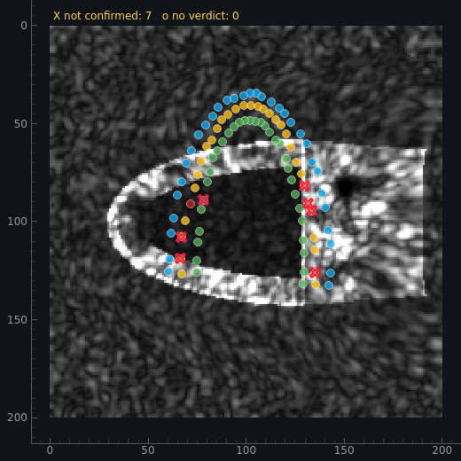
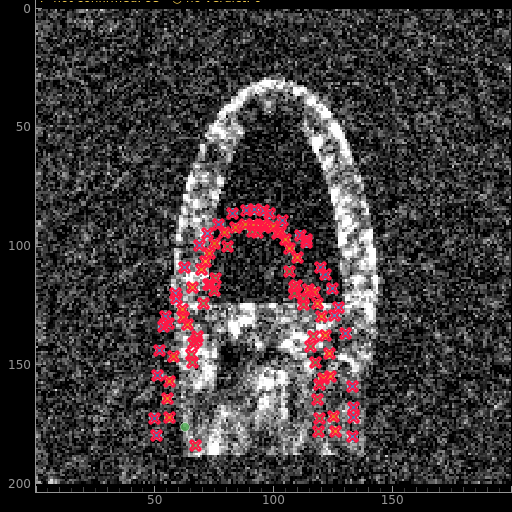

# STE: достоверность межкадрового слежения за контурами (вопрос 6)

Документ отвечает на один вопрос: **чем подтверждается, что эндо- и эпикардиальный
контуры между кадрами прослежены верно**, и что об этом говорит отчёт.

## 1. Что теперь считается

`domain/services/speckle_tracking.verify_trajectory_closure()` берёт **итоговую**
траекторию — ту, которую рисует overlay и по которой считается strain (после
интерполяции невалидных узлов, ремонта выбросных колонок и сглаживания) — и для
каждого анализируемого кадра сопоставляет патч из положения, которое показано
врачу, **назад** к конечно-диастолическому кадру. Расстояние, на которое круговой
проход не замыкается на нарисованный контур, — собственная оценка ошибки трекера,
не требующая истины. Кадр КД по определению даёт 0.

Почему отдельный проход, а не флаг внутри трекера:

* проверка описывает **сглаженную** кривую, а не сырые совпадения;
* один и тот же вердикт для всех режимов (`bidirectional` / `incremental` /
  `sequential`) — раньше проверка существовала только в `bidirectional`;
* единый порог `verification_gate_px()` = `0.5 × max(search_radius, 24)`:
  worker, харнесс и сам проход судят замыкание по одной константе (до правки
  порог зависел от режима: 4 px на `sequential` против 12 px на `bidirectional`);
* отклонённый проход **не меняет позиции и NCC**. Попытка обнулять NCC на
  отклонённых кадрах измерена и откатана: worker начинал интерполировать эти
  кадры, и 20 дБ терял 2.5 п.п. смещения GLS. Флаг — экран достоверности, а не
  приговор.

В отчёт идут `qc_closure_median_mm`, `qc_closure_p95_mm`, `qc_rejected_fraction`,
`qc_unverified_fraction`; ворота: >10 % отклонённых или >30 % без вердикта →
`review`, >25 % отклонённых → `invalid`, `confidence` умножается на
`1 − 0.5·min(max(rej, unver)/0.5, 1)`. Строка в meta strain-окна: «проверка:
подтверждено X % точек контура, замыкание Y мм»; те же числа — в CSV-экспорте и в
JSON исследования (`ste_analysis.to_dict`).

То же самое видно на изображении (клинический вариант 1): узлы, которые круговой
проход не подтвердил, помечаются на кадре красным крестом, узлы без вердикта —
жёлтым кружком, в углу — счётчик. Подтверждённые узлы не помечаются, поэтому
метки читаются как «вот здесь числу нельзя верить», а не как фон.




Порог метки — тот же `closure_gate_px`, которым пользовался отчёт: overlay не
пересчитывает правило и не может с ним разойтись.

Воспроизведение:

```bash
LD_LIBRARY_PATH=tools/qtstub/lib QT_QPA_PLATFORM=offscreen \
    ./.venv/bin/python bench/ste_contour_tracking.py --json /tmp/contour.json
LD_LIBRARY_PATH=tools/qtstub/lib QT_QPA_PLATFORM=offscreen \
    ./.venv/bin/python bench/ste_phantom.py --json /tmp/phantom.json
LD_LIBRARY_PATH=tools/qtstub/lib QT_QPA_PLATFORM=offscreen \
    ./.venv/bin/python bench/ste_trust_flags.py --json /tmp/trust.json
```

## 2. Точность контура против точной кинематики фантома

Ошибка положения узлов (мм), считается по всем кадрам анализируемого окна;
`closure` — медиана/p95 кругового прохода, `rej` — доля кадров-узлов,
отклонённых проверкой. Для варианта `rigid` (движущийся датчик) ошибка
сравнивается в системе, где посчитан strain.

| вариант | GLS / истина | endo p50/p95/max | epi p50/p95/max | closure med/p95 | rej | статус |
|---|---|---|---|---|---|---|
| uniform 40 дБ | −19.96 / −19.90 | 0.43 / 1.72 / 2.36 | 0.47 / 1.80 / 2.62 | 0.56 / 4.79 | 4.8 % | valid |
| uniform 20 дБ | −19.53 / −19.90 | 0.72 / 3.38 / 4.10 | 0.76 / 3.61 / 4.45 | 1.02 / 6.99 | 6.1 % | valid |
| long_axis 20 дБ | −19.52 / −19.51 | 0.41 / 1.06 / 2.58 | 0.48 / 1.15 / 1.79 | 0.64 / 3.62 | 4.2 % | valid |
| gradient 20 дБ | −10.53 / −9.04 | 0.73 / 1.56 / 2.15 | 0.78 / 1.65 / 2.50 | 0.95 / 3.43 | 3.4 % | valid |
| rigid 20 дБ | −0.40 / 0.00 | 0.41 / 3.29 / 17.09 | 0.39 / 2.62 / 7.65 | 1.79 / 4.64 | 3.0 % | review |
| zero 20 дБ | −0.45 / 0.00 | 0.31 / 0.57 / 3.75 | 0.31 / 0.68 / 4.15 | 0.33 / 0.89 | 0.1 % | review |
| uniform 10 дБ | −17.32 / −19.90 | 8.19 / 30.33 / 39.13 | 7.58 / 32.13 / 46.15 | 14.51 / 38.84 | 80.6 % | invalid |
| long_axis 10 дБ | −15.31 / −19.51 | 4.72 / 30.98 / 40.60 | 2.96 / 30.91 / 38.82 | 13.41 / 40.38 | 65.6 % | invalid |

На клинически приемлемых уровнях (20–40 дБ) контур держится в **2.4–4.1 мм по
p95** и в 0.4–0.8 мм по медиане; на 10 дБ это уже не измерение, и модуль говорит
`invalid`.

## 3. Работает ли флаг (без истины) — там, где он вообще может работать

`precision/recall` к истинной ошибке узла-кадра; звёздочкой помечены варианты с
переносом датчика, где ошибка меряется в системе strain, а флаг — в исходном
изображении (эти строки не лицензируют ворота).

| вариант | > 1 мм | > 2 мм | > 5 мм | > 10 мм |
|---|---|---|---|---|
| uniform 40 дБ | 0.45 / 0.08 | 0.17 / 0.15 | 0.05 / 1.00 | — |
| uniform 20 дБ | 0.73 / 0.10 | 0.57 / 0.11 | 0.02 / 0.50 | — |
| uniform 10 дБ | 0.97 / 0.66 | 0.95 / 0.69 | 0.89 / 0.77 | 0.61 / 0.84 |
| long_axis 20 дБ | 0.12 / 0.04 | — | — | — |
| long_axis 10 дБ | 0.96 / 0.58 | 0.93 / 0.70 | 0.86 / 0.95 | 0.71 / 0.97 |
| gradient 20 дБ | 0.45 / 0.05 | 0.08 / 0.09 | 0.06 / 0.57 | — |
| rigid 20 дБ * | 0.19 / 0.85 | 0.10 / 0.90 | 0.04 / 0.97 | 0.01 / 1.00 |
| zero 20 дБ * | 0.04 / 0.09 | — | — | — |

Ошибка в отклонённых кадрах против подтверждённых (p50/p95, мм):
uniform 20 дБ 2.35/4.32 против 0.72/3.53; uniform 10 дБ 15.02/33.17 против
1.52/9.11; long_axis 10 дБ 18.59/34.14 против 1.47/4.78.

### Почему подтверждение — замыкание, а не NCC

У отчёта было два кандидата в «флаги доверия»: круговой проход и NCC прямого
совпадения (число, которое клиницист видит и охотно читает как «слежение в
порядке»). Оба измерены против точной кинематики фантома
(`bench/ste_trust_flags.py`, окно ЭД–ЭС, 0.45 мм/px):

| флаг | помечено, % кадров-узлов | p95 ошибки у «доверенных» | p95 у помеченных | precision / recall (ошибка > 2 мм) |
|---|---|---|---|---|
| замыкание > гейта, 40 дБ | 4.8 | 1.06 мм | 4.57 мм | 0.19 / 0.50 |
| NCC < 0.3, 40 дБ | **0.0** | 1.23 мм | — | 0.00 / 0.00 |
| NCC < 0.7, 40 дБ | 3.6 | 1.11 мм | 4.50 мм | 0.21 / 0.43 |
| замыкание > гейта, 20 дБ | 6.2 | 3.34 мм | 4.21 мм | 0.56 / 0.10 |
| NCC < 0.3, 20 дБ | **0.0** | 3.43 мм | — | 0.00 / 0.00 |
| NCC < 0.7, 20 дБ | 3.8 | 3.42 мм | 3.64 мм | 0.38 / 0.04 |
| замыкание > гейта, 10 дБ | 76.6 | 19.44 мм | 34.29 мм | 1.00 / 0.77 |
| NCC < 0.3, 10 дБ | **0.0** | 33.67 мм | — | 0.00 / 0.00 |
| NCC < 0.7, 10 дБ | 11.1 | 33.53 мм | 35.37 мм | 1.00 / 0.11 |

Два вывода, каждый с числом:

1. **NCC не подтверждает слежение.** Его собственный порог недействительности
   (0.3) не срабатывает ни разу — ни на 40, ни на 20, ни на 10 дБ. Более
   строгий порог 0.7 на 20 дБ даёт p95 3.42 мм у «доверенных» против 3.64 мм у
   помеченных, то есть не разделяет группы вообще. NCC — метрика *совпадения
   патчей*, а не ошибки положения; в отчёте она остаётся, но как fidelity, а не
   как подтверждение.
2. **Замыкание разделяет на всех уровнях** и особенно там, где это важно:
   19.44 мм против 34.29 мм на 10 дБ при recall 0.77.

Харнесс воспроизводит долю QC до десятых (4.8 / 6.2 / 80.7 %), то есть меряет
тот же флаг, который стоит в отчёте, а не свою его версию.

Честный вывод: флаг — **высокоточный экран с разрешением ~2–5 мм**, а не полный
детектор. Там, где ошибки велики (10 дБ), он ловит их надёжно; там, где всё
хорошо (20–40 дБ), он почти не срабатывает, но и ошибки там 1–3 мм.

## 4. Границы: чего эта проверка не подтверждает

Проверка использует **нарисованный контур КД как эталон**, поэтому она слепа к
ошибке самой обводки. Сдвиг эндокардиального контура по нормалям (фантом,
истина −19.90 %, 0.45 мм/px):

| сдвиг обводки | GLS | смещение | статус | rej | closure |
|---|---|---|---|---|---|
| −4 мм | −8.63 | +11.27 п.п. | review | 6.9 % | 0.67 мм |
| −2 мм | −22.04 | −2.13 п.п. | review | 3.9 % | 0.55 мм |
| 0 мм | −19.89 | +0.01 п.п. | valid | 4.7 % | 0.55 мм |
| +2 мм | −13.30 | +6.61 п.п. | review | 5.6 % | 0.50 мм |
| +4 мм | −11.78 | +8.13 п.п. | **valid** | 5.5 % | 0.52 мм |

То есть «слежение подтверждено» ≠ «контур нарисован верно»: качество обводки КД —
отдельная ось (модель авто-контура + ручная правка), и она остаётся главным
источником смещения GLS. Модуль не должен выдавать одно за другое, и отчёт их
разделяет.

Второе ограничение: 0–10 дБ не восстанавливается никакой проверкой — там честный
ответ `invalid` (см. §8 плана).

## 5. Ворота KPI (20 вариантов фантома)

`bench/ste_phantom.py`: 20 вариантов, 15 KPI-провалов — **все на строках,
помеченных `invalid`; на строках со статусом `valid` провалов нет**. Клинически
значимые строки: uniform 20 дБ −19.53 при истине −19.90 (0.38 п.п.), long_axis
20 дБ −19.52 при −19.51, gradient 20 дБ −10.53 при −9.04 (валидная строка,
1.48 п.п. — градиент деформации по стенке); rigid 20 дБ и zero 20 дБ — `review`
с честной формулировкой «движение без деформации».

## 6. Соответствие EACVI/ASE (Voigt 2015)

Консенсус Voigt 2015 (JASE 28:183-193) — это требования к тому, **что и как
объявляет** программное обеспечение, а не к конкретному алгоритму трекинга.
Матрица по рекомендациям Task Force:

| Рекомендация Task Force | Состояние | Где в коде/отчёте |
|---|---|---|
| «явно указывать, что измеряется и с какой пространственной протяжённостью (px/мм)» | **закрыто** | `StrainResult.sampling_kernel_mm` / `sampling_node_spacing_mm`; `StrainAnalysis.sampling`; CSV `# ROI sampling` |
| «определение измерения: эндокард / средняя линия / эпикард / вся стенка» | **закрыто** | `DEFINITION_LAYER` = эндокардиальный слой; `# Layer`, `definitions.layer` |
| «спекл-трекинг должен сообщать Lagrangian strain; тип штамма указывать» | **закрыто** | `(L−L₀)/L₀` в `lagrangian_strain_pct`; `DEFINITION_GLS` содержит «Lagrangian, endocardial»; `# GLS definition` |
| «глобальный strain — по всей длине линии либо эквивалентным усреднением; усреднение пиков в разные моменты несовместимо» | **закрыто** | GLS = пик глобальной кривой, построенной по всей линии (`compute_gls`); среднее пиков сегментов — только кросс-чек (`gls_segment_mean`) |
| «если глобальный считается усреднением сегментов, исключать не более 1 сегмента на вид» | **закрыто** | ворота Q4: >1 исключённого сегмента → `invalid` |
| «сегменты — по анатомии на КД; равная длина на КД; авто-разметку можно править; выбирать вид, инверсию, флип» | **частично** | сегменты по дуге КД (`assign_segments_from_arc`, равная доля дуги от аннулуса), вид выбирается (A4C/A2C/A3C); правка границ сегментов и инверсия/флип изображения — **открыто** |
| «ESS должен докладываться по умолчанию; прочие параметры — с ясными подписями» | **закрыто** | GLS (пик), ESS и peak strain в отчёте, CSV `# ESS` / `# Peak strain`, `DEFINITION_ESS` |
| «конец диастолы: по умолчанию пик QRS; пользователь должен знать источник времени и мочь его переопределить» | **закрыто** | `ed_es_source` (manual → ЭКГ → Simpson → изображение), ручные ED/ES, `# ED frame`/`# ES frame` |
| «конец систолы: AVC; сообщать источник и давать переопределить» | **закрыто** | `avc_index`/`avc_source`/`avc_confidence`, `# AVC frame`/`# AVC source`, ручной ES |
| «указывать наличие/отсутствие компенсации трансляции ЛЖ; желателен переключатель» | **закрыто** | `translation_compensation_applied`; CSV `# LV translation compensation`; переключатель в настройках трекинга |
| «указывать применённую компенсацию дрейфа; переключатель on/off» | **закрыто** | `drift_compensation_applied` в UI, `drift_measured` в отчёте, галочка в настройках |
| «информировать о мерах регуляризации; ограничивать её минимумом; давать контроль» | **частично** | `StrainResult.regularization` + CSV `# Regularization` (метод, окна) — **закрыто в отчёте**; пользовательский контрол окна сглаживания — **открыто** |
| «автоматическая мера качества трекинга + экран, где видно трекинг поверх петли» | **закрыто** | QC-блок (NCC + покрытие + шум + видимость + Q6-замыкание) и метки недостоверного слежения поверх изображения (вариант 1) |
| «частота кадров: 40–80 Гц для движения/деформации, >100 Гц для strain rate» | **закрыто** | примечание QC при частоте вне 40–100 Гц (`frame_rate_hz`) |
| «метод работает хуже, когда стенка временно не видна» | **закрыто** | Q4: `wall_visibility.py`, `qc_visibility_loss`, исключение узлов/сегментов |
| «сравнение значений — по абсолютной величине; знак всегда указывать» | **закрыто** | знак сохраняется во всех отчётах/подписях; `GLS_AV` — среднее по валидным видам |
| «через-плоскостное движение — принципиальное ограничение 2D» | **ограничение** | не устранимо в 2D; учитывается как источник ошибки, не «исправляется» |

Итого: определения и отчётность, которые требуются консенсусом для
сопоставимости чисел, закрыты; открытыми остаются три пункта, все —
UI/настройки, а не измерения: правка границ сегментов, инверсия/флип
изображения, пользовательский контроль окна сглаживания.

## 7. Тесты

`tests/unit/test_tracking_verification.py` — 15 тестов: круговой проход по
корректной траектории замыкается, сдвинутая траектория измеряется как ошибка,
пустой кадр даёт «нет вердикта» вместо ложно-уверенного нуля, порог один и тот
же для прохода и сводки, политика QC (0.05/0.15/0.35/0.4, клампы), три
фантомных теста через worker, наличие строк в обоих языках. STE-выборка (21
файл, 441 тест) — зелёная.
