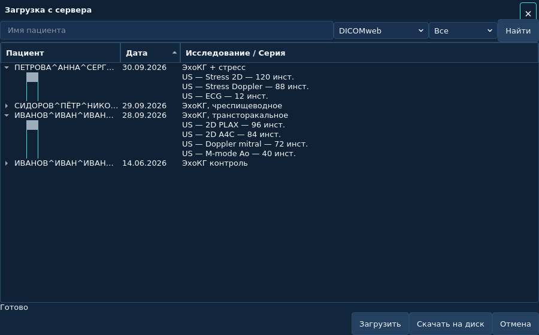
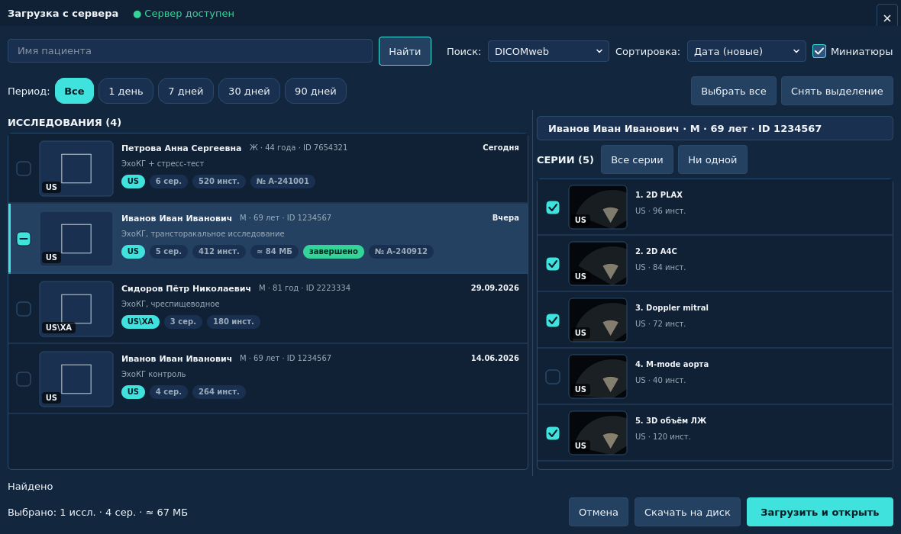
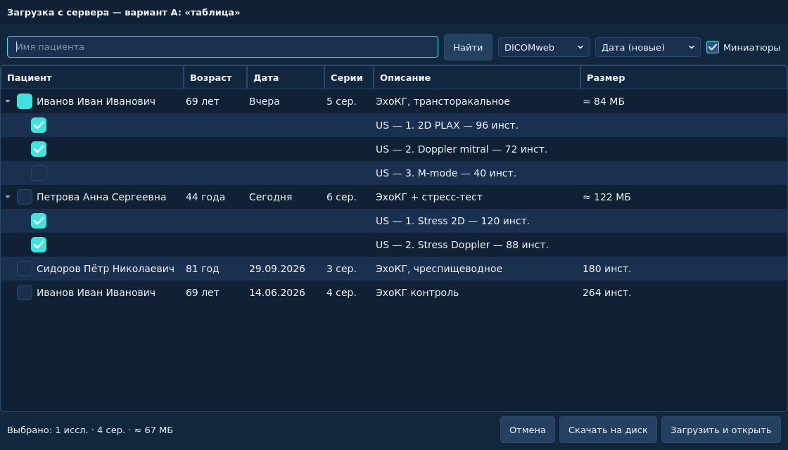
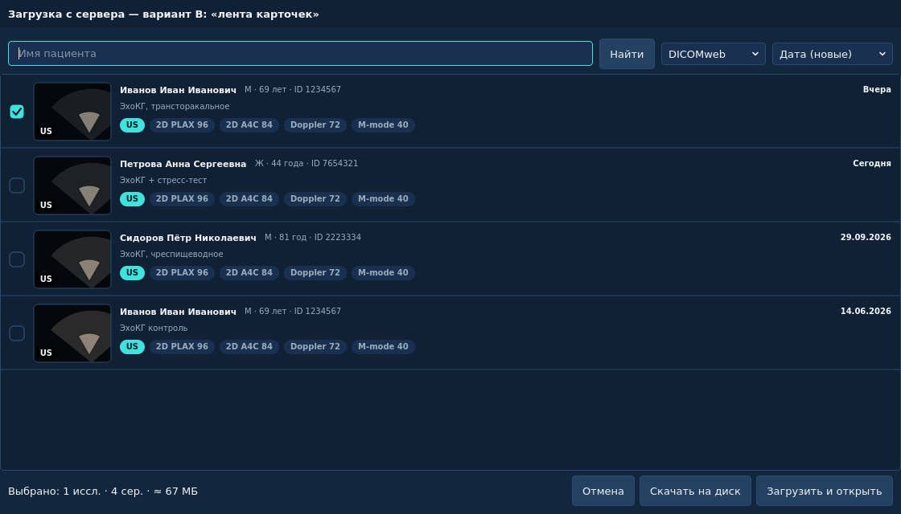
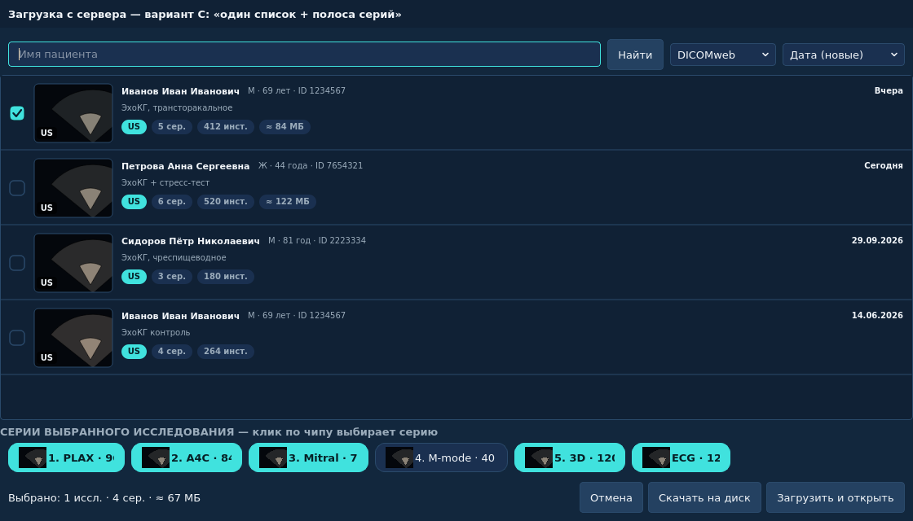
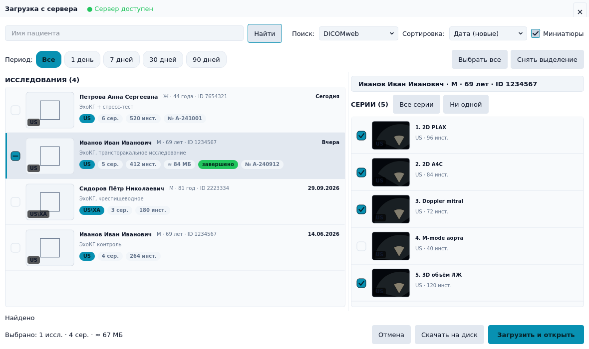
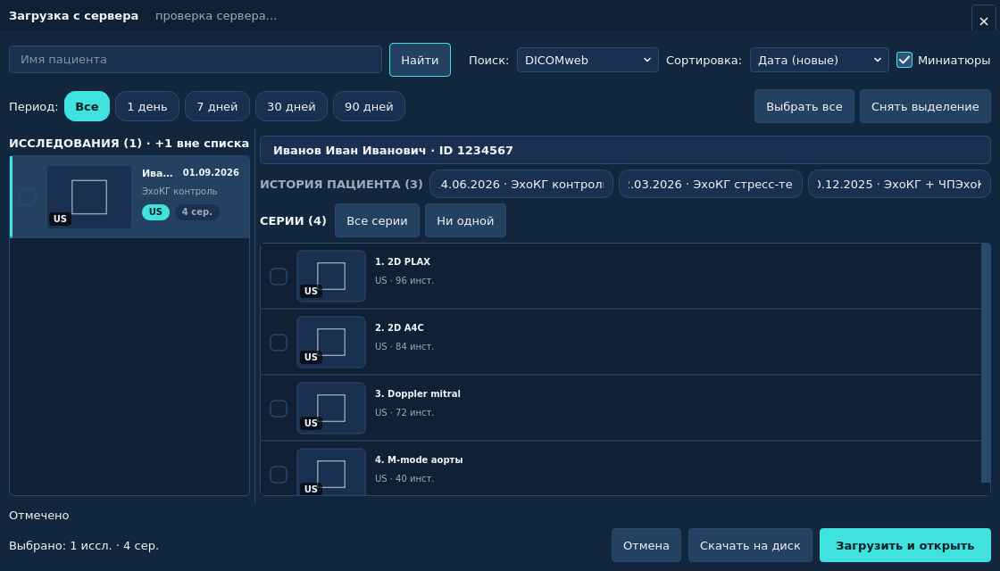

# Диалог загрузки с сервера: редизайн, варианты и что ещё отдаёт Orthanc

**Дата:** 2026-10-04
**Ветка:** `arena/01a106f3-sonoforge`
**Затронутый код:** `presentation/orthanc_study_dialog.py`, `presentation/orthanc_study_delegate.py`
(новый), `presentation/orthanc_preview_loader.py` (новый),
`domain/services/patient_display.py` (новый), `infrastructure/orthanc_client.py`,
`infrastructure/orthanc_dicom_json.py`, `domain/models/orthanc.py`

*«Было»: мелкие стрелки-раскрытия, круглые чекбоксы-«радио», нет миниатюр,
ФИО в формате `ИВАНОВ^ИВАН^ИВАНОВИЧ`, одна строка на исследование.*

*«Стало» (реализовано в этой ветке): карточки исследований с крупными чекбоксами,
пациентская строка с возрастом и полом, миниатюры, сводка выбора, полоса периода.*

---

## 1. Что было не так (разбор текущего диалога)

| # | Проблема | Почему это мешает |
|---|----------|-------------------|
| 1 | Раскрытие исследования — треугольник 9×9 px слева | Попасть курсором сложно, состояние «открыто/закрыто» визуально почти незаметно; исследование и его серии выглядят как один список |
| 2 | Чекбоксы серий — круглые (глобальный стиль `QTreeWidget::indicator`: `border-radius: 50%`) | Круг читается как «радио-кнопка/единственный выбор», хотя выбор множественный; в тёмной теме нет галочки, только заливка |
| 3 | ФИО выводится как есть: `ИВАНОВ^ИВАН^ИВАНОВИЧ`, обрезается по 200 px | Невозможно быстро найти пациента глазами; нет возраста, пола, ID |
| 4 | Нет миниатюр | ЭхоКГ выбирают «по картинке»: 2D-петля, доплер, M-mode. Без превью приходится открывать исследование вслепую |
| 5 | Одна строка на исследование, 3 колонки | Не видно ни числа серий, ни размера, ни модальности, ни статуса исследования |
| 6 | Нет сортировки, нет периода «7/90 дней», есть только «Все / 1 / 3 / 30 дней» в комбобоксе | Список на 300 исследований нечем сузить |
| 7 | Выбор только по серии: чтобы скачать исследование целиком, надо раскрыть его и отметить каждую серию | 5–8 кликов вместо одного; частая ошибка — забытая серия |
| 8 | Сводка выбора отсутствует | Не видно, сколько исследований/серий и примерно сколько мегабайт будет качаться |
| 9 | Кнопка «Загрузить» без акцента, рядом равнозначные «Отмена» и «Скачать на диск» | Не ясно главное действие |
| 10 | Статус, ошибки и прогресс — в одной строке под списком | Длинный текст ошибки переносится и «прыгает», прогресс перекрывает статус |
| 11 | Нет признака «сервер отвечает / не отвечает» | При недоступном сервере список просто пустой |

**Важное ограничение, которое надо было учесть:** превью — это PHI. Поэтому
миниатюры не пишутся на диск, живут только в памяти на время диалога, и их
можно выключить одним тумблером (настройка запоминается).

---

## 2. Как это делают в коммерческих продуктах (и что мы взяли)

| Продукт | Приём | Взяли? |
|---------|-------|--------|
| **Sectra IDS7** (PACS) | Список исследований слева, **панель превью серий** справа; двойной клик на исследовании = открыть | ✅ master-detail и двойной клик |
| **GE Synapse / Siemens** | Worklist-таблица с колонками (возраст, модальность, счётчики) + превью по наведению | ✅ возраст/пол/счётчики в строке |
| **RadiAnt / Horos / OsiriX** | Миниатюры серий с бейджем модальности, отметка серий чекбоксами | ✅ миниатюры + бейдж модальности |
| **OHIF Viewer** (web PACS) | Thumbnail list слева, серия выделяется кликом, `StudyInstanceUID` в заголовке | ✅ карточки с превью |
| **Dropbox / Google Drive / VS Code в explorer** | Тристейт-чекбокс: клик по родителю выбирает всё, частичный выбор — «полугалочка» | ✅ реализовано (панель серий + исследование) |
| **Photoshop / Lightroom** | Перетаскивание/мультивыбор, `Space` — переключить отметку | ✅ `Space` |
| **Spotify / Netflix / Steam** | Крупные строки-карточки с картинкой слева, метаданные справа от неё | ✅ карточки исследований |
| **Windows Explorer / macOS Finder** | Огромные чекбоксы, двухстрочный текст, правый край — дата/размер | ✅ |

Что **не** взяли осознанно: drag-and-drop серии в окно просмотрщика (нет
сценария — оно открывается после закрытия диалога), «плиточная» сетка
превью (для эхокардиографии 1 картинки на серию достаточно), серверный поиск
по диапазону дат (серверы по-разному отвечают на `StudyDate` с диапазоном —
фильтруем локально, чтобы поведение было одинаковым у DICOMweb и DIMSE).

---

## 3. Варианты улучшения (3 альтернативы + реализованный)

### Вариант A — «плотная таблица» (`variant_a.png`)

Строка исследования = строка таблицы: чекбокс, ФИО, возраст, дата, число серий,
описание, размер; серии — раскрываемые подстроки с чекбоксами.

* **Плюсы:** максимальная плотность (30–40 исследований на экран), привычно для
  тех, кто работает с Excel/реестрами, сортировка по любой колонке бесплатно.
* **Минусы:** нет миниатюр (или они мелкие и в колонке «Пациент» теряются),
  нужен подбор ширин колонок, менее «клинично» визуально.
* **Когда выбирать:** если основной сценарий — просмотр больших архивов и
  выгрузка по датам, а не поиск конкретного пациента.

### Вариант B — «лента карточек» (`variant_b.png`)

Каждое исследование — крупная карточка на всю ширину: превью, ФИО, демография,
дата, **чипы всех серий с количеством кадров прямо в карточке**.

* **Плюсы:** весь выбор — в одном месте, серии не нужно «раскрывать», отлично
  читается на больших мониторах.
* **Минусы:** на 20+ исследованиях список длинный; чипы серий не масштабируются
  на исследования с 15–25 сериями (в реальном PACS это норма);
  превью для каждой серии требуют много запросов.
* **Когда выбирать:** небольшие архивы, «демо»-режим, презентации.

### Вариант C — «один список + полоса серий» (`variant_c.png`)

Список исследований с превью + горизонтальная полоса чипов-серий выбранного
исследования под списком (клик по чипу = выбор серии).

* **Плюсы:** список широкий, серии всегда видны, минимум модальности.
* **Минусы:** полоса не тянет много серий (нужен скролл), чипы с миниатюрами
  быстро «съедают» вертикаль; при 25 сериях превращается в кашу.
* **Когда выбирать:** если диалог должны использовать на маленьких экранах
  ноутбуков с ограниченной высотой окна.

### Вариант D — «master-detail» (реализован, `new_dialog.png`)

Слева список исследований-карточек, справа панель серий выбранного исследования
со своими чекбоксами. Плюсы: одна метафора на любой размер архива,
масштабируется на 25 серий, миниатюры и в списке, и в сериях, места хватает на
демографию и бейджи. Минус — нужно чуть больше ширины окна (минимум 760 px).

**Итог сравнения**

| Критерий | A таблица | B карточки | C чипы | **D master-detail** |
|---|---|---|---|---|
| Плотность списка | ★★★ | ★ | ★★ | ★★ |
| Скорость выбора исследования целиком | ★★ | ★★ | ★★★ | **★★★** |
| Точный выбор серий при 15–25 сериях | ★★ | ★ | ★ | **★★★** |
| Миниатюры | ★ | ★★★ | ★★ | **★★★** |
| Работа без горизонтального скролла | ★★ | ★★ | ★ | **★★★** |
| Объём реализации | ★★★ | ★★ | ★★★ | ★★ |

Реализован вариант **D**, потому что он единственный одинаково хорошо работает
и на 5, и на 25 сериях, сохраняет поиск «по картинке» и не требует
горизонтальной прокрутки. Вариант A можно добавить позже как переключатель
«Таблица/Карточки» — делегаты row-модели для этого уже готовы.

---

## 4. Что реализовано в этой ветке

*Та же раскладка в светлой теме: карточки, панель серий, сводка выбора.*

### 4.1. Список исследований (слева)

* **Крупный квадратный чекбокс 20×20** с галочкой и **тремя состояниями**:
  отмечено / не отмечено / «полугалочка» (часть серий). Рисуется делегатом,
  клик ловится в точке чекбокса (встроенный индикатор Qt не масштабируется и
  не поддерживает хит-тест).
* **Миниатюра 96×72** с бейджем модальности (`US`, `US/XA`), статус-заглушкой,
  пока превью не получено (никаких «битых» картинок).
* **Строка пациента:** `Иванов Иван Иванович` (из `ИВАНОВ^ИВАН^ИВАНОВИЧ`),
  справа от неё — `М · 69 лет · ID 1234567`.
* **Бейджи:** модальность, `5 сер.`, `412 инст.`, `≈ 84 МБ`, `завершено`
  (из Orthanc `IsStable`), `№ A-240912` (AccessionNumber).
* **Дата** справа: «Сегодня»/«Вчера»/`29.09.2026`.
* **Статус загрузки прямо в строке:** «загрузка…», «готово», «ошибка» — видно,
  какое исследование уже скачано, а какое ещё тянется.
* **Выбор исследования целиком** — один клик по его чекбоксу (серии отмечаются
  автоматически, даже если их список ещё догружается в фоне).
* **Двойной клик** по строке = «скачать и открыть» (привычка PACS).
* `Space` — отметить текущую строку, `Ctrl+A` — выбрать все, `Ctrl+F` — поиск,
  `F5`/`Ctrl+R` — обновить, `Esc` — закрыть.

### 4.2. Панель серий (справа)

* Собственные чекбоксы и миниатюры, номер серии в заголовке (`3. Doppler mitral`),
  подзаголовок: модальность · область · число инстансов.
* Кнопки **«Все серии» / «Ни одной»**, заголовок-счётчик `СЕРИИ (5)`.
* Плашка пациента сверху (`Иванов Иван Иванович · М · 69 лет · ID 1234567`).

### 4.3. Панель инструментов и подвал

* Поиск с **дебаунсом 400 мс** и поиском по Enter; кнопка «Найти» подсвечивается
  как основная.
* **Период** — сегментированные чипы: Все / 1 / 7 / 30 / 90 дней
  (фильтрация локальная, чтобы одинаково работать с DICOMweb и DIMSE).
* **Сортировка:** дата ↓/↑, фамилия, размер.
* **Тумблер «Миниатюры»** (по умолчанию включён) — выключает все превью-запросы
  и запоминается в настройках.
* **Сводка выбора** в подвале: `Выбрано: 1 иссл. · 4 сер. · ≈ 67 МБ` (размер —
  из статистики Orthanc, помечен `≈`, так как это оценка по доле серий).
* **Индикатор сервера** в заголовке: зелёная/красная точка «Сервер доступен /
  недоступен» (асинхронный `ping`, GUI не блокируется).
* Основная кнопка «**Загрузить и открыть**» (акцентный цвет), рядом
  «Скачать на диск» и «Отмена».

### 4.4. Поведение и производительность

* Запрос серий идёт **лениво и в фоне** (лимит фоновых предвыборок — 24
  исследования; явно выбранные/открытые исследования грузятся всегда).
  Если пользователь нажал «Загрузить», а список серий ещё не пришёл, диалог
  сам дожидается ответа и продолжает загрузку (сообщение «Готовим список серий…»).
* **Превью:** отдельный загрузчик — кэш в памяти (LRU, 320 картинок), не более
  3 параллельных запросов, запрашиваются только видимые строки,
  неудачные превью больше не перезапрашиваются. Реализован фолбэк-«лестница»:
  WADO-RS `thumbnail` → WADO-RS `rendered` → Orthanc `/instances/{id}/preview`.
* **Пустой первый кадр петли** (свип, введение контраста) — типовая причина
  «чёрных» миниатюр. Загрузчик проверяет превью дешёвым зондом 32×24
  (средняя яркость и динамический диапазон) и, если кадр пустой, делает ещё
  один запрос — за кадром из **середины петли**
  (Orthanc `/instances/{id}/frames/{n}/preview`, иначе WADO-RS
  `/frames/{n}/rendered`; `NumberOfFrames` берётся из `simplified-tags`).
  Замена происходит только если середина петли информативнее, поэтому лишний
  запрос — исключение, а не правило. UID первого инстанса серии кэшируется,
  чтобы повторный запрос не повторял QIDO-поиск.
* **Расширенные поля QIDO-RS** (`PatientBirthDate`, `PatientSex`, `StudyTime`,
  `AccessionNumber`, `InstitutionName`, `ModalitiesInStudy`,
  `NumberOfStudyRelatedSeries/Instances`, `SeriesNumber`, `BodyPartExamined`)
  запрашиваются одним запросом; если строгий сервер отвечает 400 — автоматический
  повтор с минимальным набором полей, чтобы список всё равно загрузился.
* **Устаревшие ответы отбрасываются:** у каждого поиска исследований своё
  «поколение», поэтому медленный ответ предыдущего запроса не заменит список,
  в котором пользователь уже отмечает исследования.
* Локализация RU/EN (+55 ключей), тёмная/светлая/VS Code темы — без новых ассетов.

### 4.5. Тесты

* `tests/unit/test_patient_display.py` — форматирование ФИО/возраста/размеров (42 проверки).
* `tests/unit/test_orthanc_dialog_ux.py` — превью-загрузчик, разбор расширенных
  тегов, `fetch_preview`/`study_statistics` (включая multipart и 400-fallback),
  делегаты, хит-тест чекбокса, `Space`, изоляция QSS.
* `tests/unit/test_presentation_orthanc_study_dialog.py` — обновлён под новый UI:
  выбор исследования целиком, частичный выбор, скрытые фильтром исследования,
  отложенная загрузка, сводка, сортировка, панель серий.
* Прогон «как пользователь» (offscreen, демо-режим): поиск → выбор исследования
  → «Загрузить и открыть» → файлы в сессионном кэше → миниатюры в обеих панелях.
* Кадр из середины петли: маршруты `/frames/{n}/preview` и WADO-RS
  `/frames/{n}/rendered`, откат на первый кадр для одноframe-инстансов и
  серверов без `simplified-tags`, зонд «пустой кадр», повтор запроса только при
  пустой первой попытке, кэш UID первого инстанса.

### 4.6. Дефекты, найденные сценарием и исправленные рядом (коммит «fix(loader)»)

| Дефект | Последствие | Исправление |
|--------|-------------|-------------|
| Запрос серий «в полёте» считался готовым, а запись с пустым списком UID отбрасывалась | Отметили исследование → «Загрузить» сразу: диалог закрывался с «успех», но **не скачивал ни одного файла** | Выбор сохраняет запись с пустым списком, готовность ждёт фоновый запрос, пустой список трактуется как «есть что качать» |
| `OrthancDownloadWorker._make_thread_client` игнорировал `use_mock` | В демо-режиме список приходил от заглушки, а скачивание стучалось в сеть («Connection refused») | Ветка `use_mock` → `FakeDicomWebClient` |
| `FakeDicomWebClient` не имел `close`/`cancel_inflight` и отдавал пустой `fetch_preview` | Ошибка в логе фонового воркера; в демо-режиме вместо миниатюр — заглушки | Заглушка реализует весь интерфейс клиента и рисует синтетический PNG (`zlib`+`struct`, без зависимостей) |

---

### 4.7. История пациента (реализовано)

*Под плашкой пациента — полоса «ИСТОРИЯ ПАЦИЕНТА (3)»: чипы с датой и описанием
предыдущих исследований того же пациента (клик — отметить к загрузке).*

Эхо читают в сравнении с прошлым исследованием, поэтому в панели серий появилась
полоса предыдущих исследований пациента:

* запрос один на пациента за сеанс диалога, в фоне (`query_studies(patient_id=…)`
  — стандартный QIDO-RS ключ, работает и для DICOMweb, и для DIMSE), результат
  кэшируется в памяти;
* строки фильтруются по `PatientID` на стороне клиента — сервер, который
  игнорирует фильтр, не «протечёт» чужими пациентами;
* текущее исследование в полосе не показывается; список сортируется по дате
  (свежие первыми) и ограничен 6 чипами;
* клик по чипу **отмечает** то исследование к загрузке (при необходимости
  подтягивая его серии) — то есть «скачать текущее вместе с прошлым» в один
  клик; если исследование есть в текущем списке, оно ещё и выделяется;
* если отмеченное исследование не попадает в текущий результат поиска, шапка
  слева честно говорит «ИССЛЕДОВАНИЯ (1) · +1 вне списка», а не молчит;
* пустой `PatientID`, отсутствие прошлых исследований или ошибка запроса просто
  скрывают полосу: это подсказка, а не обязательный элемент.

## 5. Что ещё стоит показывать в списке (кроме ФИО и даты)

### 5.1. Нужны ли миниатюры?

**Да, но с оговорками.** Для эхокардиографии превью — самый быстрый способ
отличить «2D-петлю» от «доплера» и «M-mode», а также понять, что исследование
вообще пришло целиком (чёрный/серый сектор vs. пусто). При этом:

* превью стоят по одному HTTP-запросу на серию — значит, только для видимых
  строк и с кэшем (реализовано);
* превью — PHI, поэтому только в памяти и с возможностью отключения;
* миниатюра в списке исследований берётся у первой серии, а не генерируется
  отдельно — это дешевле и честнее («вот что внутри»).

Если сервер не умеет рендерить (старый Orthanc без DICOMweb-рендеринга, PACS
без WADO-RS rendered) — вместо картинки рисуется аккуратная заглушка, а не
ошибка. Ни один сбой превью не влияет на список.

### 5.2. Поля-кандидаты (по приоритету)

| Приоритет | Поле | DICOM-тег | Зачем в списке | Источник | Статус |
|---|---|---|---|---|---|
| **Must** | Возраст (расчётный) | (0010,0030) + (0008,0020) | Один взгляд — и понятно, взрослый/ребёнок; в эхо это критично | QIDO/DIMSE | ✅ сделано |
| **Must** | Пол | (0010,0040) | Часть идентификации, стандарт в кардиологии | QIDO/DIMSE | ✅ сделано |
| **Must** | Число серий / инстансов | (0020,1206)/(0020,1208) | Оценка объёма до скачивания | QIDO/DIMSE | ✅ сделано |
| **Must** | Миниатюра | — (рендер) | Поиск «по картинке» | Orthanc `/preview`, WADO-RS rendered | ✅ сделано |
| **Must** | Модальность | (0008,0061) | US / XA / SR — понятно, что внутри | QIDO/DIMSE | ✅ сделано |
| **Should** | Размер | Orthanc `/statistics` | Оценка времени загрузки и места | Orthanc REST | ✅ сделано (если сервер отдаёт) |
| **Should** | Готовность исследования | Orthanc `IsStable` | Не выгрузить «наполовину пришедшее» исследование | Orthanc REST | ✅ сделано |
| **Should** | AccessionNumber | (0008,0050) | Связь с направлением/РИС | QIDO/DIMSE | ✅ сделано |
| **Should** | Время исследования | (0008,0030) | Различить 3 исследования одного дня | QIDO/DIMSE | ✅ сделано (сортировка/ключ) |
| **Should** | Учреждение / станция | (0008,0080)/(0008,1010) | «откуда это пришло», разбор дублей | QIDO/DIMSE | ⏳ тег запрашиваем, в UI — как бейдж при следующей итерации |
| **Nice** | StudyID / номер исследования | (0020,0010) | Диктовка по номеру | QIDO | ⏳ |
| **Nice** | Направление/врач | (0008,0090)/(0008,1050) | Клинический контекст | QIDO | ⏳ |
| **Nice** | Позиция/вид (PLAX/A4C) | (0018,5101) / Description | Понять протокол без открытия | QIDO (в описании) | ⏳ |
| **Nice** | Метки сервера (Labels) | Orthanc `Labels` | «прочитано», «архив», «учебный» | Orthanc 1.11+ | ⏳ (см. §6) |
| **Nice** | Сердечный ритм, кадры | (0018,1088), (0028,0008) | Технический контроль качества петли | QIDO/DIMSE | ⏳ |
| **Не нужно** | Вес/рост, контраст, доза | (0010,1030) и др. | Только захламляет список | — | ✖ |

Правило: **обязательные поля показываем всегда, остальные — только если сервер
их отдал**; пустая строка лучше, чем «—» в трёх колонках.

---

## 6. Что ещё может отдать обычный сервер Orthanc

Ниже — то, что реально доступно на «обычном» Orthanc (REST + DICOMweb), с
оценкой пользы для SonoForge.

### 6.1. Превью и изображения (используется в этой ветке)

| Endpoint | Что даёт | Примечание |
|---|---|---|
| `GET /instances/{id}/preview?width=&height=` | PNG/JPEG превью первого кадра, растянутая гистограмма | Уже реализовано как фолбэк |
| `GET /instances/{id}/rendered?window-center=&window-width=&width=&height=` | Рендер с оконной обработкой | Точнее для УЗИ с «неудачным» окном |
| `GET /instances/{id}/frames/{n}/preview` | Превью конкретного кадра — **можно брать не первый кадр, а середину петли** | Хорошее улучшение качества превью |
| `GET /dicom-web/studies/{s}/series/{se}/instances/{i}/thumbnail\|rendered` | DICOMweb-стандарт (то же, но без Orthanc-специфики) | Основной путь, Orthanc 1.12+ |
| `GET /instances/{id}/image-uint8` / `image-uint16` | Полные 8/16-битные изображения без растяжки | Если нужен «честный» пиксельный просмотр |

### 6.2. Метаданные и статистика

| Endpoint | Что даёт | Куда применить |
|---|---|---|
| `GET /studies/{id}/statistics` | `CountSeries`, `CountInstances`, `DicomDiskSizeMB`, `UncompressedSize` | Размер в списке (сделано), предупреждение «большое исследование» |
| `GET /studies/{id}` | `IsStable`, `LastUpdate`, `Labels`, `MainDicomTags` | «завершено / идёт приём», время последнего обновления (сделано) |
| `GET /studies/{id}/metadata?expand` | Произвольные метаданные, включая пользовательские (`UserMetadata` в конфиге) | «Прочитано», «Отчёт подписан», номер заявки — всё, что PACS-инженер добавляет в конфиге |
| `GET /tools/labels`, фильтр `Labels`/`LabelsConstraint` | Метки ресурсов (Orthanc 1.11+/1.12+) | Быстрые фильтры «Мои», «Не прочитано», «Архив» |
| `GET /system` | Версия, плагины, доступные возможности | Показать «DICOMweb 1.4, рендеринг доступен» в настройках |
| `GET /statistics` | Заполненность хранилища Orthanc | Индикатор «сервер забит на 92 %» |
| `POST /tools/find` | Поиск с `Level`, `Query`, `Expand`, `RequestedTags`, `Limit`, `OrderBy` (1.12.5+), `Labels` | Серверная сортировка/пагинация и фильтры, которые QIDO-RS часто не умеет |

### 6.3. Изменения и синхронизация

| Endpoint | Что даёт | Куда применить |
|---|---|---|
| `GET /changes?since=<index>&limit=` | Лог появления/удаления исследований и счётчик `Last` | Режим «Что нового с прошлого визита»: список арок подтягивается за секунды; инкрементальный кэш рабочего списка |
| `GET /studies?since=<index>` (Orthanc 1.12.5+) | Только новые исследования сразу | То же, ещё проще |
| `GET /patients/{id}/studies` | Все исследования пациента | Клик по пациенту → его история (prior studies) — стандартный сценарий сравнения |

### 6.4. Скачивание/экспорт целиком

| Endpoint | Что даёт | Куда применить |
|---|---|---|
| `GET /studies/{id}/archive` | ZIP со всем исследованием (серверная упаковка) | Быстрый экспорт целого исследования одним запросом вместо N инстансов |
| `GET /studies/{id}/media` | ZIP с DICOMDIR | Экспорт для сторонних систем/диска |
| `GET /instances/{id}/content/0042,0011` | PDF-отчёт внутри DICOM, если он есть | Показать «есть заключение» в списке и открыть рядом с эхо |
| `GET /instances/{id}/frames/0/raw` | Видео/аудио-payload | ЭКГ/видео из DICOM |
| `POST /studies/{id}/export` / `.../store` | Отправить исследование на другой AE | «Переслать в архив/на копию» |

### 6.5. DIMSE (уже частично используется)

| Возможность | Что даёт | Куда применить |
|---|---|---|
| C-FIND / C-GET / C-MOVE | Работа с PACS без DICOMweb | Уже есть; расширить C-FIND полями из §5.2 (их отдают почти все PACS) |
| C-ECHO | Проверка связи | Используется в настройках; тот же индикатор, что в диалоге |
| Storage Commitment | Подтверждение, что архив принял файл | Отчёт «отправлено и принято архивом» |
| Worklists (плагин Worklists/MWL) | Список работ «по расписанию» | Режим «очередь на сегодня» |
| `POST /modalities/{aet}/query` + `/queries/{id}/retrieve` | Query/Retrieve через Orthanc как посредника | Если прямой DIMSE из клиники закрыт |

### 6.6. Что я бы внедрил следующими шагами (по соотношению польза/риск)

1. ~~**Кадр из середины петли для превью** (`frames/{n}/preview`)~~ — сделано в
   этой ветке, см. §4.4 (с зондом «пустой кадр», чтобы лишний запрос был
   исключением).
2. ~~**`/patients/{id}/studies`** — панель «предыдущие исследования» этого пациента~~
   — сделано через стандартный QIDO-RS (`query_studies(patient_id=…)`), см. §4.7.
3. **`/changes?since=`** — инкрементальный рабочий список: помнить индекс
   последней синхронизации и сокращать выдачу.
4. **PDF-заключения** (`0042,0011`) — значок «есть заключение» в списке.
5. **ZIP-экспорт исследования** (`/studies/{id}/archive`) как альтернатива
   поштучному WADO при больших исследованиях и слабой сети.
6. **Labels-фильтры** — «не прочитано / моё / архив», если PACS-инженер их ведёт.

Ограничения, которые надо помнить: всё из §6.1–6.4 — **Orthanc-специфично**
(DICOMweb-стандарт даёт только rendered/thumbnail + QIDO-поля), поэтому UI
обязан выглядеть прилично, когда этих данных нет. Именно так и сделано:
все дополнительные поля/бейджи — «если сервер отдал», а превью и статистика
деградируют до заглушек и «≈» без ошибок.

Безопасность: превью, статистика и `Labels` — потенциально PHI/метаданные
пациента. В этой ветке превью не кэшируются на диск, скачиваются только по
явному открытию диалога и отключаются тумблером.
